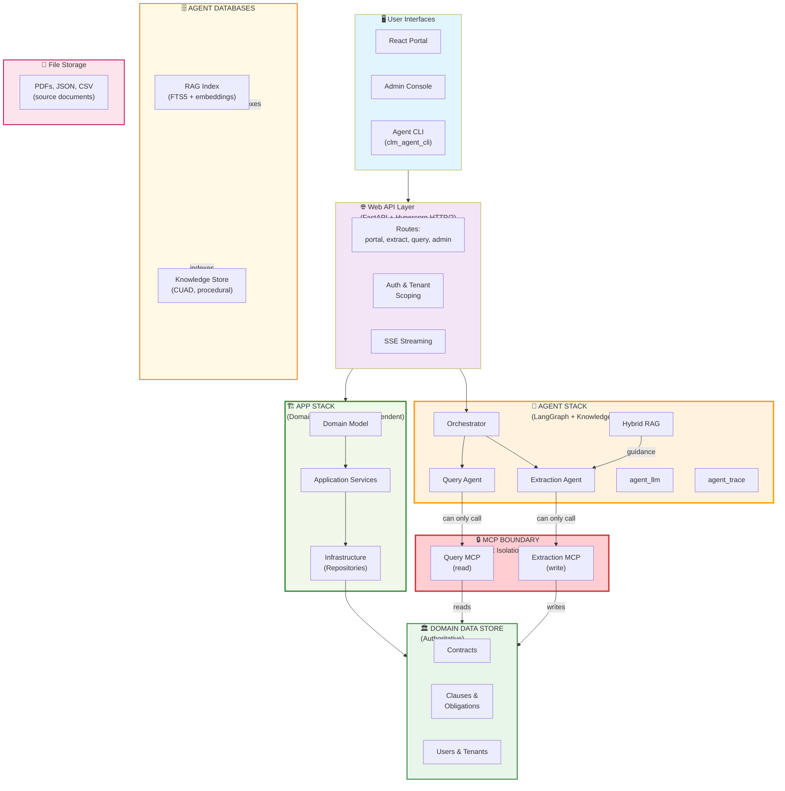

# AI-Powered Contract Intelligence

Upload contracts. Get instant insights.

An intelligent contract platform that uses AI agents to automatically **extract obligations**, **identify risks**, and **answer questions** about your contracts. No manual review. No spreadsheets.

**What you can do:**
- 📄 **Extract automatically**: Upload PDFs → AI extracts clauses, obligations, dates, renewal deadlines
- 💬 **Query with AI**: Ask "Which contracts expire this quarter?" or "Show me all confidentiality clauses" → get instant answers
- 🔍 **Semantic search**: Find similar clauses across your entire contract library using intelligent similarity, not keywords
- 📊 **Track obligations**: Automatically capture what each party owes, payment terms, renewal dates
- 🛡️ **Identify risks**: Flag missing terms, unusual provisions, compliance gaps

**How it works:**
- AI agents read contracts using Gemma4 (local LLM)
- Semantic search finds similar examples in your knowledge base using embeddings
- Results stored locally in SQLite (your data stays private)
- Access via web portal, CLI tool, or REST API

**Local-first by default**: Ollama (local LLM) means no API keys needed to get started. Switch to cloud LLMs (Claude, GPT-4, OpenRouter) anytime with a single config change.

---

## 📋 How We Got Here: Week 1 Hypothesis → Learnings

**Curious about the design decisions?** See [HYPOTHESIS_AND_LEARNINGS.md](HYPOTHESIS_AND_LEARNINGS.md):

- **Original plan**: 6 parallel agents + AWS infrastructure (Textract, S3, Outlook calendar sync)
- **What we learned**: Local-first beats infrastructure complexity; RAG improves extraction quality; observability is foundational
- **Key pivots**: Focused on extraction + query agents first • Chose local Docling over AWS Textract • Built full lifecycle UI early • Deferred calendar/alerts
- **Result**: Core AI hypothesis validated; infrastructure pivot saved months; built observability from day 1

### 🎯 Critical Discovery: What Makes Agents Grounded?

**Agents need training data to work well.** Three interconnected layers make agents grounded:

1. **Planning**: What examples does the agent need?
   - Extraction agent: "Here are 10 similar obligations from CUAD"
   - Query agent: "Here are relevant clauses for this question"
   - Without examples, agents hallucinate

2. **Data Preparation**: Quality matters more than quantity
   - CUAD contracts chunked into logical sections
   - Obligations extracted into structured JSON
   - Embeddings generated for semantic search
   - 80% of grounding quality = data prep quality

3. **Ingestion Pipeline**: Making data accessible
   - Download contracts → parse → generate embeddings → store in SQLite → searchable during agent runs
   - Setup scripts automate this (build_rag_index.py, import_rag_dataset.py)
   - Agents retrieve examples in <100ms during reasoning

**For v2 agents** (SLA classification, risk severity, obligation verification): The pattern is the same:
1. Plan what examples the agent needs
2. Prep those examples (label, structure, embed)
3. Build ingestion pipeline to make them searchable

**Key insight**: Grounded agents = high-quality training data + fast retrieval. Model size matters less than data quality.

---

## 🧠 A Counterintuitive Finding

### Common Assumption: "Bigger Model = Better Agent"
- Use GPT-4 → better extraction
- Use latest Claude → better queries
- Use most parameters → better reasoning

### Our Discovery: "Better Data = Better Agent"

**What we found**: Gemma4 (7B parameters) + high-quality training data **beats** larger models without grounding:
- Gemma4 + CUAD examples > GPT-3.5 with no examples
- Gemma4 + embeddings-based retrieval > Claude without context
- Quality of retrieved examples > raw model capability

**Why**:
- LLMs are pattern-matchers, not knowledge stores
- Show them examples of good extractions → they extract better
- Give them context from similar clauses → they synthesize better answers
- Model size matters; data quality matters more

**Implication for v2**:
- Don't chase bigger models
- Build better training data pipelines
- Invest in example curation and embedding quality
- Smaller models + grounded data > larger models alone

**This is why**:
- Extraction agent uses Gemma4 (not GPT-4)
- Query agent retrieves examples before synthesizing
- Setup builds CUAD index during initialization
- Both agents prioritize "show me examples" over "tell me rules"

---

---

**The AI Agents - Architecture:**

| Agent | Input | Process | Output | MCP Server | Memory/Context |
|-------|-------|---------|--------|------------|----------------|
| **Extraction** `agents/extraction_agent/` | PDF file | Per-page LLM extraction + RAG examples | Clauses, obligations, dates, parties | `extraction_mcp_server` (write) | Multi-page memory (accumulated facts) |
| **Query** `agents/query_agent/` | Question + history | Embeddings search → LLM synthesis | Grounded answer + sources | `query_mcp_server` (read) | Conversation history |
| **Orchestrator** `agents/orchestrator/` | User request | Route to agent, manage LLM, handle errors | Agent result/error | None | Session state |

**How Agents Work:**

**Extraction Agent**:
- **Input**: PDF contract (split into pages)
- **Context Access**:
  - System prompt (extraction rules from YAML)
  - Memory: Facts discovered on earlier pages
  - RAG retrieval: "Find similar obligations" → SQLite embeddings search → top CUAD examples
- **Process**: For each page:
  1. LLM reads page text + system prompt + memory context
  2. Retrieves similar examples from RAG index
  3. Extracts: clauses, obligations, dates, parties, risks
  4. Validates (retry if suspicious: empty on non-empty page)
  5. Updates memory with new facts
- **Output**: Structured ContractCandidate (parties, dates, clauses, obligations)
- **Domain Access**: Via `extraction_mcp_server` → writes to contract/obligations tables

**Query Agent**:
- **Input**: Natural language question + prior messages
- **Context Access**:
  - Conversation memory (previous Q&A turns)
  - Contract library (titles, metadata)
  - Embeddings index (Nomic vectors of contract sections)
- **Process**:
  1. Convert question to embeddings vector
  2. Semantic search via SQLite: find top 5 similar contract clauses
  3. Build context from retrieved sections
  4. LLM synthesizes answer using retrieved context
  5. Format response with source contracts/clauses
- **Output**: Natural language answer grounded in user's actual contracts
- **Domain Access**: Via `query_mcp_server` → reads contracts, obligations, metadata

**LLM Provider** (Configurable in `.env`):
- Default: Gemma4 via Ollama (local)
- Alternative: Claude, GPT-4, Llama via cloud provider
- All agents use same LLM provider configuration

**Access agents via:**
- 🖥️ **Web Portal** (https://localhost:5173) — Full contract lifecycle management with integrated agents
  - Upload, store, organize contracts
  - View contract text and metadata
  - Run extraction agent to auto-extract obligations, dates, risks
  - Chat with query agent to ask questions about contracts
  - Track contract status, renewals, obligations
  - Compare contracts, identify similar clauses
  - AI workspace for contract analysis
  
- 📊 **Admin Console** (https://localhost:5174) — Agent intelligence & observability (admin only)
  - View extraction/query agent execution traces
  - See LLM reasoning step-by-step
  - Debug agent decisions
  - Monitor agent performance
  
- 💻 **CLI Tool** (`scripts/agent.sh`) — Terminal-based agent access
  - Query all contracts: `ask "Which contracts expire this quarter?"`
  - Query specific contract: `ask "Show clauses" --contract-id <uuid>` (scopes to one contract)
  - Extract from file: `task "extract obligations" --file contract.pdf`
  - Interactive chat: `chat`
  - See all options: `scripts/agent.sh --help` or `uv run clm-agent --help`
  
- 🔗 **REST API** (https://localhost:8443) — Programmatic access to all operations
  - **Agent operations**: POST `/agent/query` (ask questions), POST `/agent/conversations/{id}/extractions` (extract)
  - **Contract management**: GET `/contracts` (list), POST `/contracts/upload` (upload), POST `/contracts/ingest` (process)
  - **Conversations**: POST `/agent/conversations` (start chat), POST `/agent/conversations/{id}/messages` (send message)
  - **Admin/Debug**: GET `/agent-admin/runs` (agent execution traces), GET `/agent-admin/runs/{id}/debug` (step-by-step reasoning)
  - **Authentication**: POST `/auth/token` (get bearer token), GET `/me` (current user)
  - Full OpenAPI docs at https://localhost:8443/docs

**Agent capabilities:**
- **Read**: Contract text, PDFs, previous results
- **Search**: Semantic search over contract library via embeddings
- **Reason**: Using Gemma4 LLM to analyze, extract, synthesize
- **Store**: Results in SQLite database
- **Learn**: From RAG knowledge index (examples from CUAD dataset)

## Scripts Overview

**`setup-*.sh` / `setup-windows.ps1`** (Run once)
- Installs Python virtual environment and dependencies (uv)
- Generates HTTPS certificates for local development
- Initializes SQLite database with schema
- Downloads and indexes sample contracts (CUAD dataset)
- Builds RAG knowledge index for the extraction agent
- Installs Node.js dependencies for frontend and admin console
- Creates `.env` config file with default settings
  - **Default**: `LLM_PROVIDER=ollama` (local LLM via Ollama)
  - **Customizable**: Switch to cloud providers (OpenRouter, Anthropic, etc.) by editing `.env`

**`run-all.sh` / `run-all.ps1`** (Run daily)
- Verifies all tools and dependencies are installed
- Validates LLM provider configuration:
  - **Ollama**: Checks that Ollama service is running
  - **Cloud API**: Verifies API key is configured
- Syncs Python and Node dependencies
- Starts three services: Backend API, Contract Portal, Admin Console
- Optionally creates admin account on first run

## Quick Start

### 1. Setup & Seed (One Step)
The setup script handles everything: Python env, dependencies, HTTPS certs, database, .env config, sample data, and RAG index.

**macOS:**
```bash
bash scripts/setup-mac.sh --help    # See all options
bash scripts/setup-mac.sh            # Run full setup (includes sample data)
bash scripts/setup-mac.sh --no-sample-data  # Skip sample contracts
```

**Linux/Git Bash:**
```bash
bash scripts/setup-linux.sh --help
bash scripts/setup-linux.sh
```

**Windows (PowerShell):**
```powershell
Get-Help .\scripts\setup-windows.ps1 -Detailed
.\scripts\setup-windows.ps1
```

### 2. Start the Platform
```bash
# macOS/Linux - see all options with -h
bash scripts/run-all.sh --help
bash scripts/run-all.sh                      # Start everything
bash scripts/run-all.sh --bootstrap          # First run: create admin account

# Windows
Get-Help .\scripts\run-all.ps1 -Detailed
.\scripts\run-all.ps1
```

Stop everything: `--stop` (bash) or `-Stop` (PowerShell). Logs in `.run/`.

### 3. Access the Platform

**Web Interfaces:**
- **Portal**: https://localhost:5173 (contract reader + agent workspace)
- **Admin Console**: https://localhost:5174 (extraction/query traces, admin only)
- **API**: https://localhost:8443

**Login**: `admin@capstone.local` / `CapstoneAdmin!2026`

**CLI Tool** (Command-line interface for agents):
```bash
# Query agent - ask questions about contracts
bash scripts/agent.sh ask "Which contracts expire this quarter?"

# Task agent - run a task with a file
bash scripts/agent.sh task "extract obligations" --file ./contract.pdf

# Interactive chat with the agent
bash scripts/agent.sh chat

# See all available commands
bash scripts/agent.sh --help
```

The CLI tool lets you:
- Run agents directly from terminal (no web UI needed)
- Process specific files: `--file ./contract.pdf`
- Integrate with shell scripts for automation
- Build workflows and pipelines
- Test agents without the web portal

## Quick Tour: Agent CLI in Action

**Step 1: Extract from a contract**
```bash
cd /path/to/capstone
bash scripts/agent.sh task "Extract all obligations and payment terms" --file ./contracts/vendor_agreement.pdf
```

Output:
```
✓ Task submitted. Extraction agent analyzes contract...
✓ Found 12 obligations
✓ Payment terms: Net 30, 2% early payment discount
✓ Renewal date: 2026-03-15
```

**Step 2: Ask a question about contracts**
```bash
bash scripts/agent.sh ask "Which contracts have confidentiality clauses?"
```

Output:
```
✓ Query agent searches your contracts...
✓ Found 8 contracts with confidentiality clauses:
  - vendor_agreement.pdf
  - service_contract.pdf
  - partnership_mou.pdf
  ...
```

**Step 3: Interactive chat with the agent**
```bash
bash scripts/agent.sh chat
```
```
You: Show me all contracts expiring in 2025
Agent: Based on your contracts, these expire in 2025:
  1. Software License Agreement - expires 2025-06-30
  2. Maintenance Agreement - expires 2025-12-31
  ...

You: What are the payment terms for the license agreement?
Agent: The Software License Agreement has Net 30 payment terms with...
```

**How it works under the hood:**

When you run `bash scripts/agent.sh task "Extract obligations" --file vendor.pdf`:
1. CLI logs in to API with credentials (admin@capstone.local)
2. Sends your file to the **Extraction Agent**
3. Extraction Agent:
   - Reads contract using Gemma4 (local LLM)
   - Queries RAG index: "Find similar obligations in training data"
   - Nomic embeddings search SQLite (rag_knowledge.sqlite3) → returns top examples from CUAD
   - Gemma4 uses examples to extract consistently: dates, parties, obligations, payment terms
4. Results saved to main database (capstone.db)
5. CLI displays results

When you run `bash scripts/agent.sh ask "Which contracts expire in 2025?"`:
1. CLI sends your question to **Query Agent**
2. Query Agent:
   - Nomic embeddings convert question to vector
   - Searches SQLite database for relevant contract clauses
   - Gemma4 reads retrieved clauses + your question
   - Synthesizes answer grounded in your actual contracts
3. Results displayed

**All processing is local:**
- Gemma4 runs on your machine (via Ollama)
- Embeddings computed locally (Nomic model)
- Data stored in SQLite (capstone.db, rag_knowledge.sqlite3)
- No external API calls (unless you switch LLM provider)
- Your contract data never leaves your machine

### 4. Configuration (Optional)
Edit `.env` to customize settings. Default values are set during setup:

**LLM Provider Configuration** (Default: Ollama)

| Setting | Default | Options | Notes |
|---------|---------|---------|-------|
| `LLM_PROVIDER` | `ollama` | `ollama`, `openrouter`, `anthropic`, `openai` | Requires provider-specific setup |
| `LLM_MODEL` | `gemma4:latest` | Model name for chosen provider | Must be available in your provider |
| `LLM_TIMEOUT_SECONDS` | `300` | Integer | Timeout for LLM API calls |

**How Models Work Together in Capstone Pipelines:**

**Extraction Pipeline** (Extract obligations, clauses, dates from contracts):
```
User uploads contract PDF
    ↓
Gemma4 reads contract text
    ↓
"Extract obligations from this section..."
    ↓
Nomic embeddings SEARCH RAG index:
  "Find similar obligations in CUAD dataset"
  → Returns top 3 example obligations from training data
    ↓
Gemma4 uses examples to extract with consistency:
  "Based on these examples, extract obligations from the input contract"
    ↓
Output: Structured obligation extraction
```

**Query Pipeline** (Answer questions about contracts):
```
User asks: "Which contracts expire this quarter?"
    ↓
Nomic embeddings SEARCH contract database:
  Convert question to embeddings
  → Find relevant contract clauses (semantic similarity)
    ↓
Gemma4 synthesizes answer:
  Read retrieved clauses + original question
  → Generate answer grounded in contract data
    ↓
Output: "Contracts ABC and XYZ expire in Q2"
```

**Why This Combination for Contracts:**
- **Gemma4**: Language understanding, reasoning, extraction logic
- **Nomic embeddings**: Semantic search, pattern matching, finding similar clauses
- **SQLite RAG Index**: Stores embeddings of contract clauses, enables fast semantic search
- **Together**: Provides context + examples → more accurate, consistent extraction
- **RAG (Retrieval-Augmented Generation)**: Grounds LLM answers in real contract examples

**SQLite's Role in Capstone:**

Capstone uses **two SQLite databases** working together:

1. **Main Database** (`capstone.db`):
   - Stores contracts, metadata, users, organizations
   - Tracks extraction results, obligations, expiration dates
   - Persists chat history and agent execution traces
   - Schema initialized during setup

2. **RAG Knowledge Index** (`synthetic_data_loader/rag_knowledge.sqlite3`):
   - Stores Nomic embeddings of CUAD contract clauses
   - Powers semantic search in extraction pipeline
   - Extraction agent queries: "Find similar obligations" → SQLite returns top matches
   - Query agent uses embeddings to find relevant contract sections
   - Built during setup with sample CUAD contracts

**How They Work Together:**
```
User uploads contract
    ↓
Extract → Query RAG index (SQLite embeddings)
         → "Find similar clauses in training data"
         → Nomic embeddings search returns top examples
    ↓
Gemma4 uses examples to extract consistently
    ↓
Results stored in main database (capstone.db)
    ↓
User queries contracts → Nomic embeddings search RAG → Answers grounded in data
```

**Why SQLite for both:**
- ✅ Local-first: No external database needed
- ✅ Self-contained: Embeddings and data stay on your machine
- ✅ Fast semantic search: SQLite vector extensions for embedding similarity
- ✅ Development-friendly: Single file, easy to backup/reset

**Model Selection for Capstone:**

| Component | Model | Why This Choice |
|-----------|-------|-----------------|
| **LLM** | Gemma4 | Strong instruction-following for extraction tasks, good reasoning for contract analysis, efficient for local deployment |
| **Embeddings** | Nomic Embed Text | Excellent for semantic search over legal text, generalizes well to contract terminology, fast local inference |

**Trade-offs:**
- ✅ Local-first (no API keys, privacy-focused)
- ✅ Development-friendly (no per-token costs)
- ⚠️ Slower than cloud APIs (acceptable for agent validation)
- ⚠️ Lower capability ceiling than GPT-4/Claude (sufficient for contract tasks)

**To use different models:** Edit `.env` with your LLM provider, then `uv pip install anyllm[provider]`

**Ollama (Local LLM)** - Default
```bash
LLM_PROVIDER=ollama
LLM_MODEL=gemma4:latest
OLLAMA_HOST=http://127.0.0.1:11434
EMBEDDING_MODEL=nomic-embed-text:latest
EMBEDDING_URL=http://127.0.0.1:11434/api/embed
```

**OpenRouter API** - Requires: `pip install anyllm[openrouter]`
```bash
LLM_PROVIDER=openrouter
LLM_MODEL=meta-llama/llama-2-70b-chat
OPENROUTER_API_KEY=sk_live_xxx  # Get from https://openrouter.ai
```

**Anthropic Claude** - Requires: `pip install anyllm[anthropic]`
```bash
LLM_PROVIDER=anthropic
LLM_MODEL=claude-3-5-sonnet-20241022
ANTHROPIC_API_KEY=sk-ant-xxx
```

**OpenAI** - Requires: `pip install anyllm[openai]`
```bash
LLM_PROVIDER=openai
LLM_MODEL=gpt-4-turbo
OPENAI_API_KEY=sk-xxx
```

**To switch providers:**
1. Edit `.env` with your provider's configuration
2. If using a new provider, install dependencies: `uv pip install anyllm[provider_name]`
3. Restart services: `bash scripts/run-all.sh`

**Agent Configuration:**
```bash
EXTRACTION_RAG_ENABLED=1                                    # Enable RAG for extraction
EXTRACTION_RAG_DB=synthetic_data_loader/rag_knowledge.sqlite3
EXTRACTION_RAG_VECTOR_BACKEND=sqlite
QUERY_PLAN_TOOLS=1                                          # Enable query planning
QUERY_INTERPRET=1                                           # Enable query interpretation
QUERY_VERIFY=1                                              # Enable query verification
PLANNER_MAX_STEPS=3                                         # Max planning steps
```

**Database & Server:**
```bash
DATABASE_URL=sqlite:///./capstone.db
PLATFORM_TESTING_EVALUATE=0
```

See [.env.example](.env.example) for all available options.

## Known Issues & Limitations

- **Query Agent scope in Portal**: When query agent is opened from the Portal while viewing a specific contract, it currently searches all tenant contracts instead of automatically scoping to that contract. 
  - **Root cause**: Portal UI doesn't pass contract context to agent when opening query agent
  - **Fix needed**: UI redesign to extract contract-id from current view and pass to query agent
  - **Contract scoping is fully supported** throughout the stack (API → Agent → Query MCP server), just needs Portal to pass the context
  - **Workarounds**:
    - **CLI (recommended)**: `bash scripts/agent.sh ask "Show me all clauses" --contract-id <contract-uuid>` (contract scoping works perfectly via CLI)
    - **Portal**: Mention contract explicitly in query: "In contract ABC, show me..."

## Platform Demo

See **[DEMO.md](DEMO.md)** for a complete walkthrough with:
- Login and authentication flow
- Portal dashboard overview with contract metrics  
- Contract agent workspace and multi-turn interactions
- Admin console with execution traces
- Example workflows (upload, extraction, analysis)
- Technical stack overview

**Quick highlights:**
- 📊 **Dashboard**: Shows 120 contracts, 9 pending review, 94 active
- 🤖 **Agent**: Ask questions about contracts, extract terms, identify risks
- 📋 **Extraction**: Upload PDFs, auto-extract clauses and obligations
- 🔍 **Analysis**: Compare contracts, flag missing terms, assess compliance
- 📝 **Admin Console**: Full audit trail of agent reasoning and decisions  

## Component Architecture

The platform enforces **strict isolation** between the agentic and domain layers across **three core components**:



## Architecture Documentation

Detailed documentation for each architectural layer:

- **[Isolation Strategy](docs/isolation-strategy.md)** — How agent and app stacks communicate through MCP boundaries, tenant enforcement, and independent evolution
- **[Design Principles](docs/design-principles.md)** — Core values: strict boundaries, deterministic control, local-first, per-document isolation, graceful degradation
- **[Agentic Solution Architecture](docs/agentic-architecture.md)** — Three autonomous agents (orchestrator, extraction, query), memory models, guardrails, and orchestration patterns
- **[Data Lifecycle](docs/data-lifecycle.md)** — How contract data flows from sources through loaders, processing, and storage
- **[Memory and Reasoning](docs/memory-and-reasoning.md)** — Working, episodic, and semantic memory; per-request isolation; observability
- **[System Map Legacy](docs/system-map-legacy.md)** — Original combined architecture diagram (historical reference)

## Source Organization

**Core Systems:**
- [app/](app/): Contract Lifecycle domain, application services, commands, repositories, and SQLite infrastructure.
- [mcp/](mcp/): two sanctioned MCP boundaries over shared `clm_mcp_core` infrastructure — a write-capable Extraction MCP (ingestion, retrieval, source documents) and a read-only Query MCP (tenant-scoped analysis).
- [agents/](agents/): Extraction and query agents. Extraction produces candidates from source files; query produces cited, provider-agnostic analysis of authorized contract evidence.
- [web/](web/): FastAPI backend, SQLite identity/tenant layer, agent orchestrator + planner with SSE events, the React contract portal (`web/frontend`), and the separate admin **Agent Console** (`web/admin`).

**User Interfaces:**
- [tools/clm_agent_cli/](tools/clm_agent_cli/): interactive and automation-friendly HTTP/SSE client for the agent orchestrator (CLI interface to agentic solution).
- **Chrome MCP validation agent**: external browser agent used to exercise the running portal through Chrome MCP, including login, SSE agent interaction, uploads, and visible workflow outcomes. It is not a repository package and uses the same user-facing UI as a human tester.

**Utilities & Infrastructure:**
- [tools/contract_calc/](tools/contract_calc/): shared deterministic date and money calculations (no domain logic, used by both app and agents).
- [platform_testing/](platform_testing/): YAML-defined deterministic scenarios, reports, and optional `any-llm` evaluation.
- [synthetic_data_loader/](synthetic_data_loader/): Kaggle CUAD subset download and end-to-end extraction batch driver.

**Documentation:**
- [docs/](docs/): cross-module architecture, design principles, memory model, and data lifecycle documentation.

## Module Documentation

- [Application and Domain](app/README.md)
- [MCP Servers](mcp/README.md)
- [Agents](agents/README.md)
- [Web Portal](web/README.md)
- [Agent CLI](tools/clm_agent_cli/README.md)
- [Platform Testing](platform_testing/README.md)
- [Extraction Agent README](agents/extraction_agent/README.md)
- [Extraction Architecture](agents/extraction_agent/docs/architecture.md)
- [Query Agent README](agents/query_agent/README.md)
- [Query Agent Architecture](agents/query_agent/docs/architecture.md)
- [Kaggle CUAD Scenario](agents/extraction_agent/docs/kaggle-cuad.md)
- [Memory and Reasoning](docs/memory-and-reasoning.md)
- [Contract Lifecycle DDD](app/contract-lifecycle-ddd.md)

## Browser Validation

The Chrome MCP validation agent tests the running portal as a browser user. It
starts only after the API and Bun frontend are available, authenticates with a
test account, drives UI workflows, and captures visible results. It does not
access SQLite, agent memory, or MCP servers directly. Deterministic API/domain
coverage remains in `platform_testing`; Chrome MCP complements it with browser,
SSE, and rendered-UI validation.

## CLI Usage

Run the agent orchestrator CLI (handles login):

```bash
# Ask analytical questions
./scripts/agent.sh ask "Which contracts expire this quarter?"      # macOS/Linux
.\scripts\agent.ps1 ask "Which contracts expire this quarter?"     # Windows

# Extract and analyze a contract
./scripts/agent.sh task "extract and compare to vendor agreements" --file ./vendor.pdf
```

For more details, see [web/README.md](web/README.md) and [Agent CLI documentation](tools/clm_agent_cli/README.md).

## Testing

Run deterministic platform scenarios:
```bash
uv run python -m platform_testing.runner platform_testing/scenarios/clause_template_workflow.yaml
```

Run all package tests:
```bash
uv run pytest
```

Evaluate extraction accuracy:
```bash
uv run python -m platform_testing.extraction_eval --limit 8
```

See [SETUP.md](SETUP.md) for more details on testing and troubleshooting.
