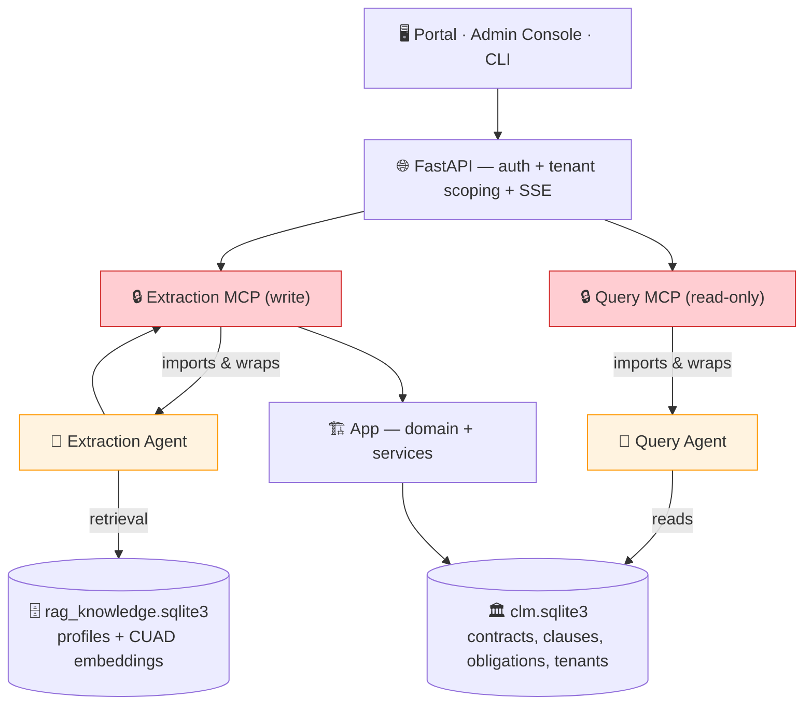

# AI-Powered Contract Intelligence

Upload contracts. Get instant insights.

An intelligent contract platform that uses AI agents to automatically **extract obligations**, **identify risks**, and **answer questions** about your contracts. No manual review. No spreadsheets.

**What you can do:**
- 📄 **Extract automatically**: Upload PDFs → AI extracts clauses, obligations, dates, renewal deadlines
- 💬 **Query with AI**: Ask "Which contracts expire this quarter?" → get instant answers
- 🔍 **Semantic search**: Find similar clauses across your entire contract library
- 📊 **Track obligations**: Automatically capture what each party owes, payment terms, renewal dates
- 🛡️ **Identify risks**: Flag missing terms, unusual provisions, compliance gaps

**How it works:** Two agents with different jobs.
- **Extraction** reads uploaded PDFs page by page with a local LLM (Gemma4), grounded by similar examples retrieved from a CUAD-derived knowledge base, and writes structured clauses/obligations/dates to SQLite.
- **Query** answers organization-wide questions *about the contracts already stored*. It plans a set of tool calls, runs **deterministic** tools for every count, list, sum, and date filter (the model never does the arithmetic), adds embedding-ranked clause search only for clause-detail questions, then drafts an answer with citations and verifies it. It cannot retrieve anything the Query MCP did not return, and a provider failure ends the run rather than producing a guess.

Access via web portal, CLI, or REST API. Local-first by default (Ollama); switch to cloud LLMs (Claude, GPT-4) anytime.

---

## 🎓 Key Learnings

**Why this architecture?** See [HYPOTHESIS_AND_LEARNINGS.md](HYPOTHESIS_AND_LEARNINGS.md) for the full story. Key insights:

1. **Data quality > model size** — Gemma4 + CUAD examples > larger models without grounding
2. **Structured prompts prevent hallucination** — Goal → Sub-goals → Constraints → Escalate conditions
3. **Grounding requires: Plan → Prep → Pipeline** — Examples → structured data → fast retrieval
4. **Local-first wins** — Docling + SQLite + Ollama > AWS infrastructure (simpler, faster, private)
5. **Observability is foundational** — Execution traces essential for debugging agents

**Detailed MCP heuristics & prompt patterns:** [MCP_HEURISTICS.md](MCP_HEURISTICS.md)

**How agents evolve:** [AGENT_HYPOTHESES.md](AGENT_HYPOTHESES.md) — track hypotheses from test → validated heuristic → embedded in code

---

## 🚀 Quick Start

### 1. Setup (One Step)

**macOS:** `bash scripts/setup-mac.sh`  
**Linux:** `bash scripts/setup-linux.sh`  
**Windows:** `.\scripts\setup-windows.ps1`

Always produced, offline, no Ollama needed:
- Python env + dependencies, HTTPS certs, `.env`
- SQLite database with the **tenant** (`Capstone` org + `admin@capstone.local`) and a **synthetic validation portfolio of 40 contracts** — so the query agent has data to answer against the moment setup finishes

Best-effort (needs Ollama / network, and setup continues without them):
- CUAD sample contracts (download) and the **RAG index** — used only by the *extraction* agent; the query agent never reads it

Options: `--no-sample-data` skips the CUAD download; `--no-validation-data` skips the synthetic portfolio; `--no-ollama` for cloud LLMs. See `--help`.

### 2. Start Services
```bash
bash scripts/run-all.sh --bootstrap  # First run: also creates the admin account
bash scripts/run-all.sh              # Subsequent runs
bash scripts/run-all.sh --stop       # Stop everything
```
On Windows: `.\scripts\run-all.ps1 -Bootstrap`. Logs in `.run/`.

### 3. Access the Platform

| Interface | URL | Use |
|---|---|---|
| **Portal** | https://localhost:5173 | Upload contracts, chat with the query agent, track obligations |
| **Admin Console** | https://localhost:5174 | Agent execution traces, reasoning debug (admin only) |
| **API** | https://localhost:8443 | REST + OpenAPI docs at `/docs` |

**Built-in review account** (created by `--bootstrap`, local use only — not a production credential):

```
Email:    admin@capstone.local
Password: CapstoneAdmin!2026
```

### 4. Quick tour with the agent CLI

`clm-agent` is an authenticated HTTP/SSE client of the running API — it does **not** call the database or MCP directly, so **the API must be running** (step 2) before any command.

**The `scripts/agent` wrapper authenticates for you.** It logs in with the built-in review account above, obtains a bearer token, and runs `clm-agent` — you do not paste a token:

```bash
# macOS / Linux                              # Windows PowerShell
bash scripts/agent.sh ask "..."              .\scripts\agent.ps1 ask "..."
```

Try these against the seeded validation portfolio (expected results in the
[Validation Data](#-validation-data--limitations) section):

```bash
bash scripts/agent.sh ask "How many contracts do we have, by lifecycle status?"
bash scripts/agent.sh ask "How many active vendor agreements?"
bash scripts/agent.sh ask "List all co-branding agreements"
bash scripts/agent.sh ask "Which contracts mention liability insurance?"
bash scripts/agent.sh ask "What payment obligations do we have across all contracts?"
bash scripts/agent.sh ask "Break down contracts by type"
bash scripts/agent.sh chat                                      # interactive
bash scripts/agent.sh ask "Show the clauses" --contract-id <uuid>
```

Use a **different account** or a raw `clm-agent` call: pass credentials to the wrapper —
`bash scripts/agent.sh --email you@org.test --password 'secret' ask "..."` — or get a
token yourself and export it:

```bash
TOKEN=$(curl -sk -X POST https://localhost:8443/auth/token \
  -d 'grant_type=password&username=admin@capstone.local&password=CapstoneAdmin!2026' \
  | python -c "import sys,json;print(json.load(sys.stdin)['access_token'])")
export CLM_AGENT_TOKEN="$TOKEN" CLM_API_URL="https://localhost:8443"
uv run clm-agent ask "How many contracts do we have?"
```

Without `CLM_AGENT_TOKEN`, `clm-agent` prompts for a bearer token interactively. Add `--json` to `ask` / `task` / `extract` for machine-readable output.

---

## 🧠 The AI Agents

| Agent | Input | Process | Output | MCP |
|-------|-------|---------|--------|-----|
| **Extraction** | PDF file | Per-page LLM extraction + RAG examples | Clauses, obligations, dates, parties, risks | `extraction_mcp_server` (write) |
| **Query** | Question + history | Plan → deterministic tools + clause search → draft → verify | Grounded answer + sources + confidence | `query_mcp_server` (read-only) |

**Extraction workflow:**
1. Split PDF into pages
2. Retrieve similar obligations from RAG index (CUAD examples)
3. LLM extracts using examples for consistency
4. Validate (retry if confidence <70%; escalate if <50% after retry)
5. Persist via MCP server

**Query workflow (`plan → gather → interpret → draft → verify`):**
1. **Plan** — one LLM call classifies the question and emits one tool call per distinct need (a count, a filtered list, a clause lookup can all be in one question). Deterministic keyword guards add any tool the planner missed, including relative-date (`expiring in 90 days`) and value (`over $1M`) filters.
2. **Gather** — run the planned calls:
   - `count_contracts` / `list_contracts` / `aggregate_contracts` — exact counts, lists, and count/sum/avg/min/max of contract value. **All arithmetic happens here; the model never computes numbers.**
   - `find_contracts` — every contract whose clause/obligation text contains a phrase (complete enumeration).
   - `search_clauses` — embedding-ranked clause snippets, only for one-/few-contract detail questions.
3. **Interpret** — for clause snippets, build a trigger → consequence → "what matters" view (best-effort).
4. **Draft** — synthesise across counts, lists, and clause evidence with citations, a confidence value, and an uncertainty flag.
5. **Verify** — counts and lists are authoritative for numbers; clause claims must be backed by cited evidence.

The Query MCP re-checks organization membership on every call. The agent cannot retrieve outside what the MCP returns; a provider failure returns a terminal run failure, not a fabricated answer.

---

## 🧪 Validation Data & Limitations

### What setup seeds

Setup runs `synthetic_data_loader/seed_contracts.py --seed capstone-review-2026 --count 40`. This is a **deterministic, offline** generator: it builds `ContractCandidate` objects from a fixed random seed (no LLM, no network) and ingests them through the same handler a real upload uses, then binds them to the `Capstone` organization. Re-running setup is idempotent.

The `capstone-review-2026` snapshot is exactly:

| Lifecycle status | Count | | Contract type | Count |
|---|---|---|---|---|
| active | 24 | | distribution-agreement | 7 |
| approved | 15 | | master-services-agreement | 6 |
| in_review | 1 | | services-agreement | 5 |
| | | | amendment | 4 |
| **Total** | **40** | | co-branding-agreement | 4 |
| | | | affiliate-agreement | 4 |
| | | | vendor-agreement | 3 |
| | | | reseller-agreement | 3 |
| | | | license-agreement | 3 |
| | | | nda | 1 |

Each contract persists: parties (country code + role), 7 clauses with full text (Payment Terms, Governing Law, Term and Termination, plus a rotating set incl. Insurance, Indemnification, Limitation of Liability…), 1–3 obligations with descriptions and due dates, and an expiration date. Party names, clause set, and dates come from fixed pools, so re-seeding anywhere reproduces the same portfolio.

**Expected answers** (the query agent composes these from tool output with no LLM call — same result on any model):

| Question | Answer |
|---|---|
| contracts by lifecycle status | 40 total — active **24**, approved **15**, in_review **1** |
| active vendor agreements | **2** |
| co-branding agreements | **4** (with names) |
| contracts mentioning liability insurance | **15** |
| breakdown by type | distribution 7, MSA 6, services 5, amendment/co-branding/affiliate 4, vendor/reseller/license 3, nda 1 |

### What this validates

The portfolio exercises the query agent's routing (choosing tools + filters) and enumeration. Counts, lists, and breakdowns are **computed by deterministic Python from `clm.sqlite3`** and templated into the answer — no model call, so a wrong number is a code bug, not model variance. The model is only invoked for **clause-synthesis** questions ("summarize our payment obligations"); those need a capable model and are slower on a small local one.

### What it does *not* validate

- **Real drafting variation.** Clauses come from a fixed template pool, so `find_contracts` (literal phrase match) and `search_clauses` (embeddings) are not stressed the way real contract language would.
- **Extraction accuracy.** These contracts are generated already-structured; no PDF is parsed. Extraction is validated separately — `uv run python -m platform_testing.extraction_eval`.
- **Value / effective-date questions.** The current seed path persists expiration dates and clause/obligation text but **not** `contract_value`, `effective_date`, or `execution_date` (dropped in the `seed_contracts.py` → `ingest_contract` mapping — a known gap). So `aggregate_contracts` sum/avg and "signed in 2024" filters return empty on this portfolio.
- **Messy entity resolution, multi-currency aggregation, jurisdiction nuance.** The generator is tidy by construction.

For depth on those, the CUAD dataset (opt-in) provides real contracts. The dataset strategy — offline-first defaults, a single contract-type catalog, a real-contract stress corpus, and the CC-BY licensing behind it — is written up in the ADRs under `docs/adr/` (proposed).

### CUAD grounding

The extraction agent's knowledge base is derived from the Contract Understanding Atticus Dataset (CUAD, CC BY 4.0). It is US-centric — the underlying contracts are SEC (EDGAR) filings — so contract-type profiles and retrieved examples carry a **US-jurisdiction bias**.

---

## ⚙️ Configuration

**LLM Providers** (edit `.env`):

| Provider | Default | Setup |
|----------|---------|-------|
| **Ollama** (local) | ✅ Gemma4 | `ollama serve` then `ollama pull gemma4:latest` |
| **OpenRouter** | — | Set `LLM_PROVIDER=openrouter` + `OPENROUTER_API_KEY` |
| **Claude (Anthropic)** | — | Set `LLM_PROVIDER=anthropic` + `ANTHROPIC_API_KEY` |
| **GPT-4 (OpenAI)** | — | Set `LLM_PROVIDER=openai` + `OPENAI_API_KEY` |

**Agent Configuration** (in `.env`):
```bash
EXTRACTION_RAG_ENABLED=1              # Enable RAG for extraction
QUERY_PLAN_TOOLS=1                    # Enable query planning
PLANNER_MAX_STEPS=3                   # Max planning iterations
```

See [.env.example](.env.example) for all options.

---

## 📊 How It Works: Extraction & Query Pipelines

**Extraction Pipeline (Extract obligations, dates, parties):**
```
User uploads PDF
  → Gemma4 reads each page
  → Nomic embeddings search RAG: "Find similar obligations"
  → Gemma4 extracts using examples for consistency
  → Results stored in clm.sqlite3
```

**Query Pipeline (Answer questions about contracts):**
```
User asks: "Which contracts expire this quarter?"
  → route: keyword + facet match → list_contracts(expiring_within_days=90)   (no LLM)
  → deterministic tools run over clm.sqlite3 (SQL, no LLM math)
  → search_clauses (embeddings) only if the question needs clause text
  → compose: structural answer templated from tool output (no LLM);
             LLM draft only for clause synthesis
  → verify: counts/lists authoritative; clause claims need cited evidence
```

**Why this design:**
- Routing and structural composition are deterministic — a wrong count is a code bug, not model variance
- Deterministic tools: every count, sum, and date filter, exact and auditable, in `contract_calc`
- The model is used only for clause synthesis and the verify pass; the tour's count/list/breakdown questions are model-independent
- RAG (`rag_knowledge.sqlite3`) is extraction-only — the query agent never reads it

---

## 🗄️ Two SQLite Databases

- **clm.sqlite3** — Domain data (contracts, obligations, users, organizations). **This is what the query agent reads.**
- **rag_knowledge.sqlite3** — Extraction-agent knowledge base (contract-type profiles + CUAD clause embeddings). Used only when *extracting* a new PDF; the query agent does not touch it.

Separation intentional: domain data evolves with user work; the knowledge base improves extraction quality.

---

## 📁 Project Structure

**Core Systems:**
- [app/](app/) — Contract domain, application services, SQLite infrastructure
- [mcp/](mcp/) — Write-capable Extraction MCP + read-only Query MCP (strict isolation boundary)
- [agents/](agents/) — Extraction and query agents
- [web/](web/) — FastAPI backend, React portal, admin console

**User Interfaces:**
- [tools/clm_agent_cli/](tools/clm_agent_cli/) — CLI tool for agents

**Utilities:**
- [tools/contract_calc/](tools/contract_calc/) — Date and money calculations
- [platform_testing/](platform_testing/) — Deterministic scenarios + evaluation
- [synthetic_data_loader/](synthetic_data_loader/) — Synthetic validation portfolio (`seed_contracts.py`), CUAD download + RAG indexing

**Documentation:**
- [docs/](docs/) — Architecture, design principles, memory model, data lifecycle

See individual READMEs in each module for details.

---

## 🔧 Testing

```bash
# Run deterministic platform scenarios
uv run python -m platform_testing.runner platform_testing/scenarios/clause_template_workflow.yaml

# Run all tests
uv run pytest

# Evaluate extraction accuracy
uv run python -m platform_testing.extraction_eval --limit 8
```

See [SETUP.md](SETUP.md) for troubleshooting.

---

## ⚠️ Known Issues

**Query agent scope in Portal**: When opened while viewing a contract, searches all tenant contracts instead of scoping to that contract.
- **Workaround (CLI)**: `bash scripts/agent.sh ask "Show clauses" --contract-id <uuid>` (works perfectly)
- **Workaround (Portal)**: Mention contract explicitly in query: "In contract ABC, show me..."

**Synthetic seed drops some fields**: `seed_contracts.py` → `ingest_contract` does not persist `contract_value`, `effective_date`, or `execution_date`, so value-aggregation and effective-date questions return empty on the validation portfolio. Clause/obligation text and expiration dates are persisted. See [Validation Data & Limitations](#-validation-data--limitations).

---

## 📚 Component Architecture



**Key principles**: agents reach the domain only through MCP servers (which enforce tenant scope + schema); the MCP servers *import and wrap* the agents (one process, one boundary crossed per request); the query agent reads `clm.sqlite3` only — `rag_knowledge.sqlite3` is extraction-only. See [docs/isolation-strategy.md](docs/isolation-strategy.md).

**Architecture documentation:** [docs/](docs/) — isolation strategy, design principles, agentic architecture, data lifecycle, memory & reasoning.

---

## 📖 Full Documentation

- **[HYPOTHESIS_AND_LEARNINGS.md](HYPOTHESIS_AND_LEARNINGS.md)** — Week 1 learnings, pivots, architecture decisions
- **[MCP_HEURISTICS.md](MCP_HEURISTICS.md)** — MCP server specifications, heuristics, prompt patterns
- **[AGENT_HYPOTHESES.md](AGENT_HYPOTHESES.md)** — R&D roadmap: active hypotheses, validated heuristics, testing cadence
- **[DEMO.md](DEMO.md)** — Platform walkthrough with screenshots
- **[SETUP.md](SETUP.md)** — Detailed setup, troubleshooting, testing
- **[docs/](docs/)** — Architecture, design principles, memory model, data lifecycle

## Resources

- **Module READMEs**: [app/](app/README.md), [mcp/](mcp/README.md), [agents/](agents/README.md), [web/](web/README.md), [CLI](tools/clm_agent_cli/README.md)
- **Agent Architecture**: [Extraction](agents/extraction_agent/docs/architecture.md), [Query](agents/query_agent/docs/architecture.md)
- **Extraction Agent**: [README](agents/extraction_agent/README.md), [CUAD Scenario](agents/extraction_agent/docs/kaggle-cuad.md)
- **Domain Model**: [Contract Lifecycle DDD](app/contract-lifecycle-ddd.md)
