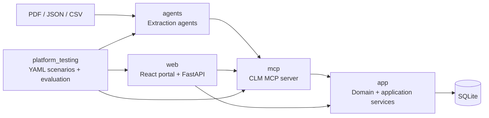

# Capstone Contract Lifecycle Platform

A local-first Contract Lifecycle Management platform that combines a domain-driven contract application, MCP integrations, extraction agents, a tenant-aware web portal, and YAML-driven workflow testing.

## System Map



## Source Organization

- [app/](app/): Contract Lifecycle domain, application services, commands, repositories, and SQLite infrastructure.
- [mcp/](mcp/): MCP server exposing sanctioned contract ingestion, retrieval, and source-document tools.
- [agents/](agents/): Extraction agent packages for PDF/JSON/CSV processing and MCP handoff.
- [web/](web/): FastAPI backend, SQLite identity/tenant layer, React portal, bearer auth, clause management, and HTTP/2 local serving.
- [platform_testing/](platform_testing/): YAML-defined deterministic scenarios, reports, and optional `any-llm` evaluation.
- [sythetic_data_loader/](sythetic_data_loader/): Kaggle CUAD subset download and end-to-end extraction batch driver.
- [docs/](docs/): Cross-module documentation space.

## Module Documentation

- [Application and Domain](app/README.md)
- [MCP Server](mcp/README.md)
- [Agents](agents/README.md)
- [Web Portal](web/README.md)
- [Platform Testing](platform_testing/README.md)
- [Extraction Agent README](agents/extraction_agent/README.md)
- [Extraction Architecture](agents/extraction_agent/docs/architecture.md)
- [Kaggle CUAD Scenario](agents/extraction_agent/docs/kaggle-cuad.md)
- [Contract Lifecycle DDD](app/contract-lifecycle-ddd.md)

## Local Setup

Install the Python packages into the active environment:

```powershell
python -m pip install -e .\app
python -m pip install -e .\mcp
python -m pip install -e .\agents
python -m pip install -e .\web
python -m pip install -e .\platform_testing
```

For the portal, generate local certificates with `mkcert` and follow [web/README.md](web/README.md). Start the React development server from `web/frontend` with Bun.

## Validation

Run deterministic platform scenarios:

```powershell
$env:PYTHONPATH = "app;mcp;agents;web;."
python -m platform_testing.runner platform_testing\scenarios\clause_template_workflow.yaml
python -m platform_testing.runner platform_testing\scenarios\contract_draft_workflow.yaml
```

Run package tests:

```powershell
python -m pytest app\contract_lifecycle\tests mcp\tests agents\tests
```

## Local Test Account

The local development database uses:

- Username: `admin@capstone.local`
- Password: `CapstoneAdmin!2026`
- Organization: `Capstone`

These credentials are for local development only.
