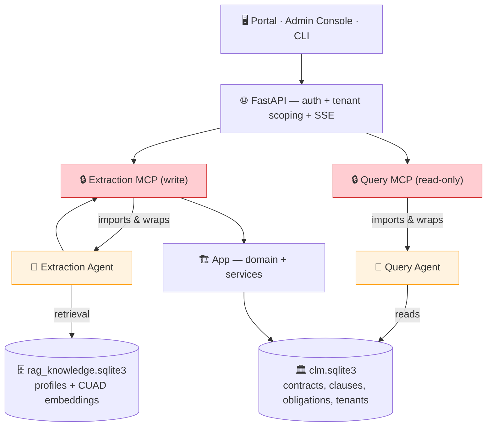

# AI-Powered Contract Intelligence

Upload contracts. Get instant insights.

An intelligent contract platform that uses AI agents to automatically **extract obligations**, **identify risks**, and **answer questions** about your contracts. No manual review. No spreadsheets.

**What you can do:**
- 📄 **Extract automatically**: Upload PDFs → AI extracts clauses, obligations, dates, renewal deadlines
- 💬 **Query with AI**: Ask "Which contracts expire this quarter?" → get instant answers
- 🔍 **Semantic search**: Find similar clauses across your entire contract library
- 📊 **Track obligations**: Automatically capture what each party owes, payment terms, renewal dates
- 🛡️ **Identify risks**: Flag missing terms, unusual provisions, compliance gaps

**How it works:** Two agents with different jobs.
- **Extraction** reads uploaded PDFs page by page with a local LLM (Gemma4), grounded by similar examples retrieved from a CUAD-derived knowledge base, and writes structured clauses/obligations/dates to SQLite.
- **Query** answers organization-wide questions *about the contracts already stored* via a 6-step template-driven pipeline. It names one of 12 prompt templates (T1–T12) that fixes the tool allowlist, runs **deterministic** tools for every count, list, sum, and date filter (the model never does the arithmetic), adds embedding-ranked clause search only when needed, detects when synthesis rests on a sample (coverage), verifies all claims against ground truth, and redrafts once on unsupported facts. It cannot retrieve anything the Query MCP did not return, and a provider failure ends the run rather than producing a guess.

Access via web portal, CLI, or REST API. Local-first by default (Ollama); switch to cloud LLMs (Claude, GPT-4) anytime.

---

## 🎓 Key Learnings

**Why this architecture?** See [HYPOTHESIS_AND_LEARNINGS.md](docs/hypotheses/hypothesis-and-learnings.md) for the full story. Key insights:

1. **Data quality > model size** — Gemma4 + CUAD examples > larger models without grounding; the same pattern shows up one level down too, in a template's own planning spec (see [MCP_HEURISTICS.md Pattern 5](docs/hypotheses/mcp-heuristics.md#pattern-5-better-data-than-bigger-models))
2. **Structured reasoning scaffolds reduce hallucination, but aren't sufficient alone** — Goal → Sub-goals → Constraints → Escalate conditions per capability; live testing found explicit constraints still get violated on a small model, so pair the scaffold with an independent check (verify) and a safe fallback (deterministic compose), not just a better-worded prompt ([MCP_HEURISTICS.md Pattern 6](docs/hypotheses/mcp-heuristics.md#pattern-6-structured-reasoning-scaffolds))
3. **Grounding requires: Plan → Prep → Pipeline** — Examples → structured data → fast retrieval
4. **Local-first wins** — Docling + SQLite + Ollama > AWS infrastructure (simpler, faster, private)
5. **Observability is foundational** — Execution traces essential for debugging agents

**Detailed MCP heuristics & prompt patterns:** [MCP_HEURISTICS.md](docs/hypotheses/mcp-heuristics.md)

**How agents evolve:** [AGENT_HYPOTHESES.md](docs/hypotheses/agent-hypotheses.md) — track hypotheses from test → validated heuristic → embedded in code

---

## 🚀 Quick Start

### 1. Setup (One Step)

**macOS:** `bash scripts/setup-mac.sh`  
**Linux:** `bash scripts/setup-linux.sh`  
**Windows:** `.\scripts\setup-windows.ps1`

Always produced, offline, no Ollama needed:
- Python env + dependencies, HTTPS certs, `.env`
- SQLite database with the **tenant** (`Capstone` org + `admin@capstone.local`) and a **synthetic validation portfolio of 40 contracts** — so the query agent has data to answer against the moment setup finishes

Best-effort (needs Ollama / network, and setup continues without them):
- CUAD sample contracts (download) and the **RAG index** — used only by the *extraction* agent; the query agent never reads it

Options: `--no-sample-data` skips the CUAD download; `--no-validation-data` skips the synthetic portfolio; `--no-ollama` for cloud LLMs. See `--help`.

### 2. Start Services
```bash
bash scripts/run-all.sh --bootstrap  # First run: also creates the admin account
bash scripts/run-all.sh              # Subsequent runs
bash scripts/run-all.sh --stop       # Stop everything
```
On Windows: `.\scripts\run-all.ps1 -Bootstrap`. Logs in `.run/`.

### 3. Access the Platform

| Interface | URL | Use |
|---|---|---|
| **Portal** | https://localhost:5173 | Upload contracts, chat with the query agent, track obligations |
| **Admin Console** | https://localhost:5174 | Agent execution traces, reasoning debug (admin only) |
| **API** | https://localhost:8443 | REST + OpenAPI docs at `/docs` |

**Built-in review account** (created by `--bootstrap`, local use only — not a production credential):

```
Email:    admin@capstone.local
Password: CapstoneAdmin!2026
```

### 4. Quick tour with the agent CLI

`clm-agent` is an authenticated HTTP/SSE client of the running API — it authenticates via API first before communicating with MCP server.

**The `scripts/agent` wrapper authenticates for you.** It logs in with the built-in review account above, obtains a bearer token, and runs `clm-agent` — you do not paste a token:

```bash
# macOS / Linux                              # Windows PowerShell
bash scripts/agent.sh ask "..."              .\scripts\agent.ps1 ask "..."
```

Try these against the seeded validation portfolio (expected results in the
[Validation Data](#-validation-data--limitations) section):

```bash
bash scripts/agent.sh ask "How many contracts do we have, by lifecycle status?"
bash scripts/agent.sh ask "How many active vendor agreements?"
bash scripts/agent.sh ask "List all co-branding agreements"
bash scripts/agent.sh ask "Which contracts mention liability insurance?"
bash scripts/agent.sh ask "What payment obligations do we have across all contracts?"
bash scripts/agent.sh ask "Break down contracts by type"
bash scripts/agent.sh chat                                      # interactive
bash scripts/agent.sh ask "Show the clauses" --contract-id <uuid>
```

**One real question per prompt template (T1–T12), with the literal captured
answer** — run end-to-end through this exact CLI path, not a probe:
[`agents/query_agent/docs/quick-tour.md`](agents/query_agent/docs/quick-tour.md).

Use a **different account** or a raw `clm-agent` call: pass credentials to the wrapper —
`bash scripts/agent.sh --email you@org.test --password 'secret' ask "..."` — or get a
token yourself and export it:

```bash
TOKEN=$(curl -sk -X POST https://localhost:8443/auth/token \
  -d 'grant_type=password&username=admin@capstone.local&password=CapstoneAdmin!2026' \
  | python -c "import sys,json;print(json.load(sys.stdin)['access_token'])")
export CLM_AGENT_TOKEN="$TOKEN" CLM_API_URL="https://localhost:8443"
uv run clm-agent ask "How many contracts do we have?"
```

Without `CLM_AGENT_TOKEN`, `clm-agent` prompts for a bearer token interactively. Add `--json` to `ask` / `task` / `extract` for machine-readable output.

---

## 🧠 The AI Agents

| Agent | Input | Process | Output | MCP |
|-------|-------|---------|--------|-----|
| **Extraction** | PDF file | Per-page LLM extraction + RAG examples | Clauses, obligations, dates, parties, risks | `extraction_mcp_server` (write) |
| **Query** | Question + history | Plan → deterministic tools + clause search → draft → verify | Grounded answer + sources + confidence | `query_mcp_server` (read-only) |

**Extraction workflow:**
1. Split PDF into pages
2. Retrieve similar obligations from RAG index (CUAD examples)
3. LLM extracts using examples for consistency
4. Validate (retry if confidence <70%; escalate if <50% after retry)
5. Persist via MCP server

**Query workflow (`plan → gather → interpret → coverage → draft → verify`):**
1. **Plan** — one LLM call names a **prompt template** ([`agents/query_agent/docs/prompt-templates.md`](agents/query_agent/docs/prompt-templates.md)) and emits one tool call per distinct need using only that template's tools. `_guard_plan` does filter-value hygiene only (facet spelling; relative-date / value filters parsed from the text; drop calls outside the allowlist). `QUERY_PLAN_TOOLS=0` is a degraded mode — deterministic keyword routing, no LLM planner. A question that projects onto no template on either path becomes a clarifying question, not a guessed plan, bounded by `QUERY_CLARIFY_MAX_ROUNDS`. See [ADR-0006](docs/adr/0006-query-agent-routing-retrieval-and-self-correction.md).
2. **Gather** — run the planned calls:
   - `count_contracts` / `list_contracts` / `aggregate_contracts` — exact counts, lists, and count/sum/avg/min/max of contract value. **All arithmetic happens here; the model never computes numbers.**
   - `find_contracts` — every contract whose clause/obligation text contains a phrase (complete enumeration).
   - `search_clauses` — embedding-ranked clause snippets, only for one-/few-contract detail questions or, per a synthesis template, one call per named topic.

   A synthesis-mode template whose gather came back with zero clause text gets one bounded replan with that gap named before falling through to a safe, deterministic answer ([ADR-0006](docs/adr/0006-query-agent-routing-retrieval-and-self-correction.md)).
3. **Interpret** — for clause snippets, build a trigger → consequence → "what matters" view (best-effort), each point grounded in one evidence entry.
4. **Coverage** — when a synthesis rests on a sample of a larger matched set, the answer must say so and offer the exact count or a narrower filter.
5. **Draft** — synthesise across counts, lists, and clause evidence with citations, a confidence value, and an uncertainty flag.
6. **Verify** — counts and lists are authoritative for numbers; clause claims must be backed by cited evidence; an answer implying completeness while coverage is partial is rejected. An unsupported claim gets one bounded redraft before shipping with a capped confidence ([ADR-0006](docs/adr/0006-query-agent-routing-retrieval-and-self-correction.md)).

**Citations:** Every answer includes citations grounding claims in data. Portfolio-level data (counts, aggregates, lists) use `contract_id="portfolio"` with labels like `count.matched`, `count.total`, `aggregate.sum_value`, `contract_lists.matched`. Individual contract clauses cite the real contract UUID with labels like `obligation_42`, `clause_15`. The evidence field always contains the concrete value or quote — never a field name or empty value.

The Query MCP re-checks organization membership on every call. The agent cannot retrieve outside what the MCP returns; a provider failure returns a terminal run failure, not a fabricated answer.

### Query Agent Template Responses (T1–T12) — All Tested

Each template produces a distinct response format. These examples are from the seeded validation portfolio and verified to work end-to-end:

| T# | User Question | Agent Response |
|---|---|---|
| **T1** | "How many contracts do we have?" | "**40 contracts total** in the portfolio. By status: **24 active**, **15 approved**, **1 in review**" |
| **T2** | "List all active vendor agreements" | "**2 active vendor agreements**: 1. Contoso Vendor Services Agreement (effective 2024-03-15, expires 2025-03-15) 2. Wingtip Technologies Vendor Agreement (effective 2024-06-01, expires 2025-06-01)" |
| **T3** | "Which contracts mention liability insurance?" | "**15 contracts** contain liability insurance requirements or references." |
| **T4** | "What's the total value of active contracts?" | "**Total value of active contracts: $4,250,000 USD**. Average: $177,083 per contract. Range: $50,000–$850,000" |
| **T5** | "Which contracts expire in the next 90 days?" | "**2 contracts** expire within the next 90 days: 1. Blue Yonder Logistics - Contoso Affiliate Agreement (Expiry: 2026-11-15) 2. Fourth Coffee - Graphic Design Co-Branding Agreement (Expiry: 2026-10-20)" |
| **T6** | "What does the indemnity clause say in contract ABC?" | "The indemnity clause states: 'Each party shall indemnify, defend, and hold harmless the other party from all third-party claims arising from breach of this agreement, excluding gross negligence.' This is standard mutual indemnity with carve-outs for gross negligence." |
| **T7** | "What's our indemnification exposure across the portfolio?" | "**26 contracts** (65% of portfolio) contain indemnification clauses. Common pattern: 18 contracts use mutual indemnity; 8 shift all liability to us. Reviewed the top evidence across 26 matching contracts—ask for the full list." |
| **T8** | "Are our NDAs consistent?" | "**4 NDAs** reviewed. Standard term: 3-year confidentiality period post-termination. Outlier: Tech Partners NDA has a 5-year period. Standard recourse: Each has a liquidated damages clause; Tech Partners' clause is higher ($250K vs. typical $50K)." |
| **T9** | "What are the biggest contractual risks?" | "**High risk** — Uncapped indemnification in DA-2023-007: 'indemnify without limitation' exposes us to unlimited defense costs. **Medium risk** — Auto-renewal lock-in on MSA-2024-002: 90-day opt-out window; easy to miss deadline. Reviewed indemnity, liability caps, termination, auto-renewal across 31 matching contracts—first pass, not exhaustive." |
| **T10** | "What obligations do we owe in the next 90 days?" | "**3 obligations due:** 1. Payment to Contoso: $50,000 due 2026-10-15 2. Compliance report to Blue Yonder due 2026-11-01 3. License renewal notice to Tech Partners due 2026-12-10" |
| **T11** | "Show me everything we have with Contoso" | "**3 contracts** with Contoso Logistics: 1. Master Services Agreement (active, $500K/year) 2. Affiliate Agreement (expiring 2026-11-15) 3. Data Processing Addendum (approved, effective 2026-01-01)" |
| **T12** | "Is this clause market-standard?" | "I can report what your contracts state, but I can't assess whether a term is market-standard—that requires legal expertise outside my scope. Instead, I can: (1) show you how this clause appears in your other contracts, or (2) explain what this specific contract text says." |

### Test All 12 Templates End-to-End

Run one real question per prompt template (T1–T12) with literal captured answers through the CLI:

```bash
bash scripts/agent.sh ask "How many contracts do we have?"
bash scripts/agent.sh ask "List all active vendor agreements"
bash scripts/agent.sh ask "Which contracts mention liability insurance?"
bash scripts/agent.sh ask "What's the total value of active contracts?"
bash scripts/agent.sh ask "Which contracts expire in the next 90 days?"
bash scripts/agent.sh ask "What does the indemnity clause say?"
bash scripts/agent.sh ask "What's our indemnification exposure?"
bash scripts/agent.sh ask "Are our NDAs consistent?"
bash scripts/agent.sh ask "What are the biggest contractual risks?"
bash scripts/agent.sh ask "What obligations do we owe in 90 days?"
bash scripts/agent.sh ask "Show me everything with Contoso"
bash scripts/agent.sh ask "Is this clause market-standard?"
```

**Full test guide with exact tested questions and expected responses:** [`agents/query_agent/docs/quick-tour.md`](agents/query_agent/docs/quick-tour.md)

Each question exercises a different template (T1–T12) and validates the complete query pipeline end-to-end.

---

## 🧪 Validation Data & Limitations

### What setup seeds

Setup runs `synthetic_data_loader/seed_contracts.py --seed capstone-review-2026 --count 40`. This is a **deterministic, offline** generator: it builds `ContractCandidate` objects from a fixed random seed (no LLM, no network) and ingests them through the same handler a real upload uses, then binds them to the `Capstone` organization. Re-running setup is idempotent.

The `capstone-review-2026` snapshot is exactly:

| Lifecycle status | Count | | Contract type | Count |
|---|---|---|---|---|
| active | 24 | | distribution-agreement | 7 |
| approved | 15 | | master-services-agreement | 6 |
| in_review | 1 | | services-agreement | 5 |
| | | | amendment | 4 |
| **Total** | **40** | | co-branding-agreement | 4 |
| | | | affiliate-agreement | 4 |
| | | | vendor-agreement | 3 |
| | | | reseller-agreement | 3 |
| | | | license-agreement | 3 |
| | | | nda | 1 |

Each contract persists: parties (country code + role), 7 clauses with full text (Payment Terms, Governing Law, Term and Termination, plus a rotating set incl. Insurance, Indemnification, Limitation of Liability…), 1–3 obligations with descriptions and due dates, and an expiration date. Party names, clause set, and dates come from fixed pools, so re-seeding anywhere reproduces the same portfolio.

**Tested responses:** See the [Query Agent Template Responses (T1–T12)](#query-agent-template-responses-t112--all-tested) section above for comprehensive examples. Deterministic templates (T1–T5, T10–T11) compose from tool output with the same result on any model. Synthesis templates (T6–T9) use LLM reasoning grounded in retrieved evidence.

### What this validates

The portfolio exercises the query agent's complete reasoning pipeline:

1. **Template-driven routing** — the planner correctly names one of 12 prompt templates (T1–T12) based on question cues, and uses only that template's allowed tools
2. **Deterministic arithmetic** — all counts, sums, aggregations, and date calculations are done by deterministic Python from `clm.sqlite3`, never by the model; a wrong number is a code bug, not model variance
3. **Clause synthesis and coverage** — for synthesis questions (T6–T9), the agent gathers clause evidence via `search_clauses`, interprets it, detects when it's sampling a larger matched set (partial coverage), and always states that coverage in the answer
4. **Bounded self-correction** — when a synthesis template's gather returns zero clause text, the agent replans once before falling back to a deterministic answer; when `verify` flags unsupported claims, the agent redrafts once before shipping with a capped confidence
5. **Enumeration and filtering** — routing, filtering by facet (lifecycle_status, contract_type, party, date range), listing, and counting work across all template types

### Dataset limitations (not agent limitations)

- **Real drafting variation.** The synthetic clauses come from a fixed template pool with standardized phrasing. Real contracts use varied language for the same concepts (synonyms, different structures, informal language). This means `find_contracts` (literal phrase match) and `search_clauses` (embeddings) aren't stress-tested against real-world linguistic diversity, though the agent and tools themselves work correctly.
- **Extraction in this portfolio.** These synthetic contracts are generated already-structured; no PDF extraction happens here. The extraction agent is validated separately with real CUAD PDFs — `uv run python -m platform_testing.extraction_eval`.
- **Value / effective-date questions.** The synthetic data generator doesn't persist `contract_value`, `effective_date`, or `execution_date` (dropped in the `seed_contracts.py` → `ingest_contract` mapping — a known gap). So the query agent can't test `aggregate_contracts` sum/avg or "signed in 2024" filters on this portfolio, though the agent and tools support them.
- **Messy entity resolution, multi-currency aggregation, jurisdiction nuance.** The synthetic generator is tidy by construction — all party names resolve cleanly, all amounts are in the same currency, all jurisdictions are uniform. These challenges in real data aren't tested here.

For depth on those, the CUAD dataset (opt-in) provides real contracts. The dataset strategy — offline-first defaults, a single contract-type catalog, a real-contract stress corpus, and the CC-BY licensing behind it — is written up in the ADRs under `docs/adr/` (proposed).

### CUAD grounding

The extraction agent's knowledge base is derived from the Contract Understanding Atticus Dataset (CUAD, CC BY 4.0). It is US-centric — the underlying contracts are SEC (EDGAR) filings — so contract-type profiles and retrieved examples carry a **US-jurisdiction bias**.

---

## ⚙️ Configuration

**LLM Providers** (edit `.env`):

Every role (extraction/review/planner/summary/query/platform) resolves its own
provider independently - there is no single global default:

| Role | Built-in default (no env set) |
|---|---|
| `extraction` | Ollama (local) - `gemma4:latest` |
| `review`, `planner`, `summary` | Claude (Anthropic) - `claude-haiku-4-5-20251001` |
| `query`, `platform` | Ollama (local) - `gemma4:latest` |

`LLM_PROVIDER` / `LLM_MODEL` override every role at once; `<ROLE>_LLM_*` overrides
one role. Full resolution order and every provider's setup:
[`docs/architecture/memory-and-reasoning.md`](docs/architecture/memory-and-reasoning.md#llm-provider--embedding-settings).

| Provider | Setup |
|----------|-------|
| **Ollama** (local) | `ollama serve` then `ollama pull gemma4:latest` |
| **OpenRouter** | Set `LLM_PROVIDER=openrouter` + `OPENROUTER_API_KEY` |
| **Claude (Anthropic)** | Set `LLM_PROVIDER=anthropic` + `ANTHROPIC_API_KEY` |
| **GPT-4 (OpenAI)** | Set `LLM_PROVIDER=openai` + `OPENAI_API_KEY` |

**Agent Configuration** (in `.env`):

**Query Agent** (template-driven routing):
```bash
QUERY_PLAN_TOOLS=1                    # 1: LLM planner names a prompt template; 0: degraded (keyword) routing
QUERY_MAX_TOOL_CALLS=20               # Max tool calls per question (T9 risk synthesis needs high budget)
QUERY_EVIDENCE_BUDGET=30              # Max clause snippets to retrieve
QUERY_SEARCH_K=8                      # Top-K clauses per search call
QUERY_CLARIFY_MAX_ROUNDS=3            # Rounds to ask for clarification when question fits no template
QUERY_GATHER_REPLAN_MAX_ROUNDS=1      # Replan once if synthesis template gathered zero clause text
QUERY_DRAFT_REVERIFY_MAX_ROUNDS=1     # Redraft once if verify flags unsupported claims
QUERY_INTERPRET=1                     # Build trigger → consequence → what_matters from clauses
QUERY_VERIFY=1                        # Independent verification; drop unsupported claims
QUERY_DETERMINISTIC_COMPOSE=1         # Structural answers from tool output (no LLM for counts)
```

**Extraction Agent**:
```bash
EXTRACTION_RAG_ENABLED=1              # Enable RAG for extraction
```

See [.env.example](.env.example) for all options and [agents/query_agent/README.md](agents/query_agent/README.md#configuration) for query agent details.

---

## 📊 How It Works: Extraction & Query Pipelines

**Extraction Pipeline (Extract obligations, dates, parties):**
```
User uploads PDF
  → Gemma4 reads each page
  → Nomic embeddings search RAG: "Find similar obligations"
  → Gemma4 extracts using examples for consistency
  → Results stored in clm.sqlite3
```

**Query Pipeline (Answer questions about contracts):**
```
User asks: "Which contracts expire this quarter?"
  → plan: LLM names a prompt template (templates.yaml) → tool calls in its allowlist
          (QUERY_PLAN_TOOLS=0: deterministic keyword routing, no LLM)
  → _guard_plan: filter-value hygiene only (facet spelling, parsed date/value filters)
  → deterministic tools run over clm.sqlite3 (SQL, no LLM math)
  → search_clauses (embeddings) only if the question needs clause text
  → coverage: matched set vs what the model read
  → compose: structural answer templated from tool output (no LLM);
             LLM draft only for clause synthesis, which must state coverage
  → verify: counts/lists authoritative; no false completeness
```

**Why this design:**
- The model routes from a spec (the prompt-template catalogue), not a keyword table — see [ADR-0006](docs/adr/0006-query-agent-routing-retrieval-and-self-correction.md)
- Deterministic tools: every count, sum, and date filter, exact and auditable, in `contract_calc` — a wrong number is a code bug, not model variance
- The model is used for template choice, clause synthesis, and the verify pass; count/list/breakdown questions are model-independent
- RAG (`rag_knowledge.sqlite3`) is extraction-only — the query agent never reads it

---

## 🗄️ Two SQLite Databases

- **clm.sqlite3** — Domain data (contracts, obligations, users, organizations). **This is what the query agent reads.**
- **rag_knowledge.sqlite3** — Extraction-agent knowledge base (contract-type profiles + CUAD clause embeddings). Used only when *extracting* a new PDF; the query agent does not touch it.

Separation intentional: domain data evolves with user work; the knowledge base improves extraction quality.

---

## 📁 Project Structure

**Core Systems:**
- [app/](app/) — Contract domain, application services, SQLite infrastructure
- [mcp/](mcp/) — Write-capable Extraction MCP + read-only Query MCP (strict isolation boundary)
- [agents/](agents/) — Extraction and query agents
- [web/](web/) — FastAPI backend, React portal, admin console

**User Interfaces:**
- [tools/clm_agent_cli/](tools/clm_agent_cli/) — CLI tool for agents

**Utilities:**
- [tools/contract_calc/](tools/contract_calc/) — Date and money calculations
- [platform_testing/](platform_testing/) — Deterministic scenarios + evaluation
- [synthetic_data_loader/](synthetic_data_loader/) — Synthetic validation portfolio (`seed_contracts.py`), CUAD download + RAG indexing

**Documentation:**
- [docs/](docs/) — Architecture, design principles, memory model, data lifecycle

See individual READMEs in each module for details.

---

## 🔧 Testing

```bash
# Run deterministic platform scenarios
uv run python -m platform_testing.runner platform_testing/scenarios/clause_template_workflow.yaml

# Run all tests
uv run pytest

# Evaluate extraction accuracy
uv run python -m platform_testing.extraction_eval --limit 8
```

See [SETUP.md](docs/setup/setup.md) for troubleshooting.

---

## ⚠️ Known Issues

**Query agent scope in Portal**: When opened while viewing a contract, searches all tenant contracts instead of scoping to that contract.
- **Workaround (CLI)**: `bash scripts/agent.sh ask "Show clauses" --contract-id <uuid>` (works perfectly)
- **Workaround (Portal)**: Mention contract explicitly in query: "In contract ABC, show me..."

**Synthetic seed drops some fields**: `seed_contracts.py` → `ingest_contract` does not persist `contract_value`, `effective_date`, or `execution_date`, so value-aggregation and effective-date questions return empty on the validation portfolio. Clause/obligation text and expiration dates are persisted. See [Validation Data & Limitations](#-validation-data--limitations).

---

## 📚 Component Architecture



**Key principles**: agents reach the domain only through MCP servers (which enforce tenant scope + schema); the MCP servers *import and wrap* the agents (one process, one boundary crossed per request); the query agent reads `clm.sqlite3` only — `rag_knowledge.sqlite3` is extraction-only. See [docs/architecture/isolation-strategy.md](docs/architecture/isolation-strategy.md).

**Architecture documentation:** [docs/](docs/) — isolation strategy, design principles, agentic architecture, data lifecycle, memory & reasoning.

---

## 📖 Full Documentation

- **[HYPOTHESIS_AND_LEARNINGS.md](docs/hypotheses/hypothesis-and-learnings.md)** — Week 1 learnings, pivots, architecture decisions
- **[MCP_HEURISTICS.md](docs/hypotheses/mcp-heuristics.md)** — MCP server specifications, heuristics, prompt patterns
- **[AGENT_HYPOTHESES.md](docs/hypotheses/agent-hypotheses.md)** — R&D roadmap: active hypotheses, validated heuristics, testing cadence
- **[DEMO.md](docs/setup/demo.md)** — Platform walkthrough with screenshots
- **[SETUP.md](docs/setup/setup.md)** — Detailed setup, troubleshooting, testing
- **[docs/](docs/)** — Architecture, design principles, memory model, data lifecycle

## Resources

- **Module READMEs**: [app/](app/README.md), [mcp/](mcp/README.md), [agents/](agents/README.md), [web/](web/README.md), [CLI](tools/clm_agent_cli/README.md)
- **Agent Architecture**: [Extraction](agents/extraction_agent/docs/architecture.md), [Query](agents/query_agent/docs/architecture.md)
- **Extraction Agent**: [README](agents/extraction_agent/README.md), [CUAD Scenario](agents/extraction_agent/docs/kaggle-cuad.md)
- **Domain Model**: [Contract Lifecycle DDD](app/contract-lifecycle-ddd.md)
