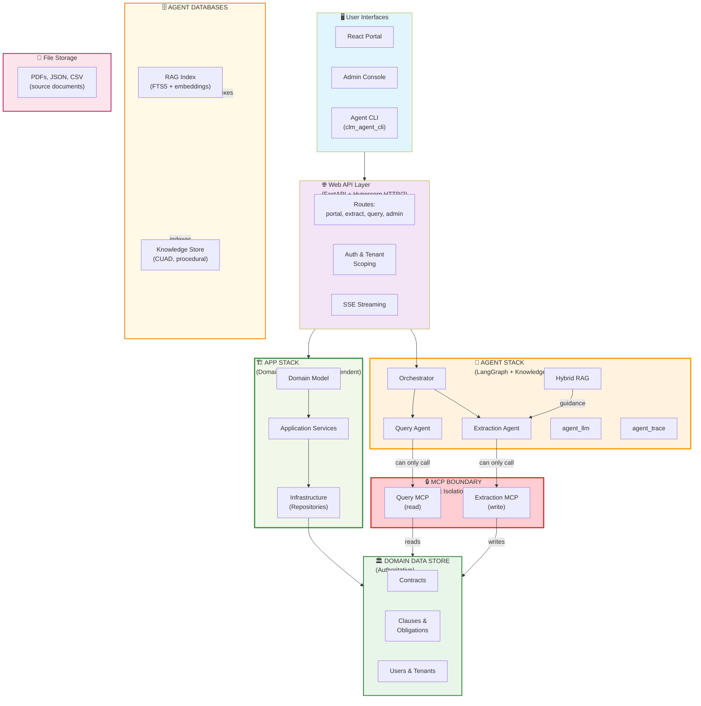

# Capstone Contract Lifecycle Platform

A local-first Contract Lifecycle Management platform that combines a domain-driven contract application, MCP integrations, extraction agents, a tenant-aware web portal, and YAML-driven workflow testing.

## Quick Start

### 1. Setup
Run the setup script for your platform (see [SETUP.md](SETUP.md)):

**macOS:**
```bash
bash scripts/setup-mac.sh
```

**Linux/Git Bash:**
```bash
bash scripts/setup-linux.sh
```

**Windows (PowerShell):**
```powershell
.\scripts\setup-windows.ps1
```

Each script handles: Python env, dependencies, HTTPS certs, database, .env config, and RAG index.

### 2. Seed Sample Data
See [SEEDING.md](SEEDING.md) for downloading and indexing CUAD contracts and setting up the RAG knowledge base.

**TL;DR**:
```bash
python seed_database.py          # Download CUAD contracts + build RAG index
```

### 3. Start the Platform
```bash
# macOS/Linux
bash scripts/run-mac.sh

# Windows
.\scripts\run-all.ps1
```

Access:
- **Portal**: https://localhost:5173 (contract reader + agent workspace)
- **Admin Console**: https://localhost:5174 (extraction/query traces, admin only)
- **API**: https://localhost:8443

**Login**: `admin@capstone.local` / `CapstoneAdmin!2026`

## Platform Demo

See **[DEMO.md](DEMO.md)** for a complete walkthrough with:
- Login and authentication flow
- Portal dashboard overview with contract metrics  
- Contract agent workspace and multi-turn interactions
- Admin console with execution traces
- Example workflows (upload, extraction, analysis)
- Technical stack overview

**Quick highlights:**
- 📊 **Dashboard**: Shows 120 contracts, 9 pending review, 94 active
- 🤖 **Agent**: Ask questions about contracts, extract terms, identify risks
- 📋 **Extraction**: Upload PDFs, auto-extract clauses and obligations
- 🔍 **Analysis**: Compare contracts, flag missing terms, assess compliance
- 📝 **Admin Console**: Full audit trail of agent reasoning and decisions  

## Component Architecture

The platform enforces **strict isolation** between the agentic and domain layers across **three core components**:



## Architecture Documentation

Detailed documentation for each architectural layer:

- **[Isolation Strategy](docs/isolation-strategy.md)** — How agent and app stacks communicate through MCP boundaries, tenant enforcement, and independent evolution
- **[Design Principles](docs/design-principles.md)** — Core values: strict boundaries, deterministic control, local-first, per-document isolation, graceful degradation
- **[Agentic Solution Architecture](docs/agentic-architecture.md)** — Three autonomous agents (orchestrator, extraction, query), memory models, guardrails, and orchestration patterns
- **[Data Lifecycle](docs/data-lifecycle.md)** — How contract data flows from sources through loaders, processing, and storage
- **[Memory and Reasoning](docs/memory-and-reasoning.md)** — Working, episodic, and semantic memory; per-request isolation; observability
- **[System Map Legacy](docs/system-map-legacy.md)** — Original combined architecture diagram (historical reference)

## Source Organization

**Core Systems:**
- [app/](app/): Contract Lifecycle domain, application services, commands, repositories, and SQLite infrastructure.
- [mcp/](mcp/): two sanctioned MCP boundaries over shared `clm_mcp_core` infrastructure — a write-capable Extraction MCP (ingestion, retrieval, source documents) and a read-only Query MCP (tenant-scoped analysis).
- [agents/](agents/): Extraction and query agents. Extraction produces candidates from source files; query produces cited, provider-agnostic analysis of authorized contract evidence.
- [web/](web/): FastAPI backend, SQLite identity/tenant layer, agent orchestrator + planner with SSE events, the React contract portal (`web/frontend`), and the separate admin **Agent Console** (`web/admin`).

**User Interfaces:**
- [tools/clm_agent_cli/](tools/clm_agent_cli/): interactive and automation-friendly HTTP/SSE client for the agent orchestrator (CLI interface to agentic solution).
- **Chrome MCP validation agent**: external browser agent used to exercise the running portal through Chrome MCP, including login, SSE agent interaction, uploads, and visible workflow outcomes. It is not a repository package and uses the same user-facing UI as a human tester.

**Utilities & Infrastructure:**
- [tools/contract_calc/](tools/contract_calc/): shared deterministic date and money calculations (no domain logic, used by both app and agents).
- [platform_testing/](platform_testing/): YAML-defined deterministic scenarios, reports, and optional `any-llm` evaluation.
- [synthetic_data_loader/](synthetic_data_loader/): Kaggle CUAD subset download and end-to-end extraction batch driver.

**Documentation:**
- [docs/](docs/): cross-module architecture, design principles, memory model, and data lifecycle documentation.

## Module Documentation

- [Application and Domain](app/README.md)
- [MCP Servers](mcp/README.md)
- [Agents](agents/README.md)
- [Web Portal](web/README.md)
- [Agent CLI](tools/clm_agent_cli/README.md)
- [Platform Testing](platform_testing/README.md)
- [Extraction Agent README](agents/extraction_agent/README.md)
- [Extraction Architecture](agents/extraction_agent/docs/architecture.md)
- [Query Agent README](agents/query_agent/README.md)
- [Query Agent Architecture](agents/query_agent/docs/architecture.md)
- [Kaggle CUAD Scenario](agents/extraction_agent/docs/kaggle-cuad.md)
- [Memory and Reasoning](docs/memory-and-reasoning.md)
- [Contract Lifecycle DDD](app/contract-lifecycle-ddd.md)

## Browser Validation

The Chrome MCP validation agent tests the running portal as a browser user. It
starts only after the API and Bun frontend are available, authenticates with a
test account, drives UI workflows, and captures visible results. It does not
access SQLite, agent memory, or MCP servers directly. Deterministic API/domain
coverage remains in `platform_testing`; Chrome MCP complements it with browser,
SSE, and rendered-UI validation.

## CLI Usage

Run the agent orchestrator CLI (handles login):

```bash
# Ask analytical questions
./scripts/agent.ps1 ask "Which contracts expire this quarter?"

# Extract and analyze a contract
./scripts/agent.ps1 task "extract and compare to vendor agreements" --file ./vendor.pdf
```

For more details, see [web/README.md](web/README.md) and [Agent CLI documentation](tools/clm_agent_cli/README.md).

## Testing

Run deterministic platform scenarios:
```bash
uv run python -m platform_testing.runner platform_testing/scenarios/clause_template_workflow.yaml
```

Run all package tests:
```bash
uv run pytest
```

Evaluate extraction accuracy:
```bash
uv run python -m platform_testing.extraction_eval --limit 8
```

See [SETUP.md](SETUP.md) for more details on testing and troubleshooting.
