# Agent Internals

The graph carries a `PipelineState` from loading, through format-specific extraction, to MCP ingestion. PDF extraction is page-oriented; JSON and CSV records bypass the LLM and are mapped directly into the same candidate shape.

```mermaid
flowchart LR
  Input["run(file_path, database_path)"] --> State["PipelineState\nfile_path + database_path"]
  State --> LoadNode["load_node()"]
  LoadNode --> Loader["loaders.load()"]
  Loader --> Document["LoadedDocument\nformat + bytes + hash + chunks"]
  Document --> Format{"Loaded format"}

  Format -->|PDF| PDFLoop["extract_node()\niterate chunks in page order"]
  PDFLoop --> Context["preceding_tail\nlast 200 characters"]
  Context --> ExtractPage["extraction_node.extract_page()"]
  ExtractPage --> LLM["any_llm.acompletion()\nsystem_prompt.yaml + PageExtraction"]
  LLM --> PageResult["PageExtraction"]
  PageResult --> MorePages{"More PDF pages?"}
  MorePages -->|yes| PDFLoop
  MorePages -->|no| Merge["merge_node.merge_page_extractions()"]
  Merge --> MergeRules["first non-null singleton\nnormalized list deduplication\nfield conflict recording"]
  MergeRules --> Candidate["ContractCandidate"]

  Format -->|JSON / CSV| RecordLoop["extract_node()\niterate structured chunks"]
  RecordLoop --> Hash["content_hash_for(record bytes)"]
  Hash --> Mapper["structured_mapper.from_structured_record()"]
  Mapper --> Mapping["nested fields or\nparty_N_* CSV columns"]
  Mapping --> Candidate

  Candidate --> IngestNode["ingest_node()"]
  IngestNode --> MCP["mcp_client.ingest_via_mcp()"]
  MCP --> Results["PipelineState.results\nMCP IngestResult dictionaries"]
```

## Internal Steps

1. **Start the graph**: `pipeline.run()` accepts the source path and optional database path, then invokes the compiled LangGraph with an initial `PipelineState`.
2. **Load the source**: `load_node()` calls `loaders.load()`, which reads the bytes, computes the SHA-256 content hash, detects the extension, and creates either page chunks or structured record chunks.
3. **Select an extraction path**: `extract_node()` branches on `LoadedDocument.format`. PDFs use the LLM path; JSON and CSV inputs use the structured path without an LLM call.
4. **Prepare PDF context**: PDF chunks are processed in page order. `preceding_tail` passes the last 200 characters of the previous page to the next call so clauses split across pages retain continuity.
5. **Extract one PDF page**: `extract_page()` sends the page text, continuity context, and the prompt loaded from `system_prompt.yaml` to `any_llm.acompletion()`. The response is parsed into a `PageExtraction` model.
6. **Merge PDF results**: After all pages finish, `merge_page_extractions()` combines page results into one `ContractCandidate`, deduplicates repeated list entries, keeps the first non-null singleton value, and records conflicting singleton values.
7. **Map structured records**: JSON objects and CSV rows are converted by `structured_mapper.from_structured_record()`. Nested JSON lists are parsed directly, while numbered CSV columns such as `party_1_name` are expanded into typed fields.
8. **Ingest candidates**: `ingest_node()` sends each `ContractCandidate` to `mcp_client.ingest_via_mcp()`, which launches or connects to the MCP server over stdio and calls `ingest_contract`.
9. **Return results**: MCP responses are stored in `PipelineState.results` and returned by `pipeline.run()` as dictionaries containing the contract id, lifecycle status, idempotency result, skipped stages, and field conflicts.
