# Agent Internals

The graph carries a `PipelineState` through `load → extract → review → ingest`.
PDF extraction is page-oriented; JSON and CSV records bypass the LLM and are
mapped directly into the same candidate shape. `review` is the one
document-level reasoning pass - it runs only for the PDF branch.

```mermaid
flowchart LR
  Input["run() / arun(file_path, database_path,\nextraction_directive, progress_callback)"] --> State["PipelineState"]
  State --> LoadNode["load_node() -> loaders.load()"]
  LoadNode --> Document["LoadedDocument\nformat + bytes + hash + chunks"]
  Document --> Format{"Loaded format"}

  Format -->|PDF| RAG["retrieve_profile_with_vectors()\nhybrid RAG over first ~3 pages"]
  RAG --> PDFLoop["extract_node()\niterate chunks in page order"]
  PDFLoop --> Context["preceding_tail (EXTRACTION_PAGE_TAIL_CHARS)\n+ working memory {title, contract_type,\nparties, defined_terms, last_heading}\n+ non-authoritative directive + RAG profile"]
  Context --> ExtractPage["extract_page()\nreasoning (CoT) field + retry"]
  ExtractPage --> LLM["any_llm.acompletion()\nsystem_prompt.yaml + PageExtraction"]
  LLM --> PageResult["PageExtraction\n(+ trace entry, memory folded forward)"]
  PageResult --> MorePages{"More pages?"}
  MorePages -->|yes| PDFLoop
  MorePages -->|no| Merge["merge_page_extractions()\n-> ContractCandidate"]
  Merge --> ReviewNode["review_node()\ndocument-level reasoning pass"]
  ReviewNode --> Reviewed["candidate + review_findings\n+ review_summary"]

  Format -->|JSON / CSV| RecordLoop["extract_node()\nstructured_mapper (no LLM, no review)"]
  RecordLoop --> Reviewed

  Reviewed --> IngestNode["ingest_node()"]
  IngestNode --> Blocker{"blocker finding?"}
  Blocker -->|yes| Confirm["result: requires_human_confirmation\n(no write)"]
  Blocker -->|no| MCP["ingest_via_mcp()\nextraction_mcp_server.server"]
  MCP --> Results["PipelineState.results"]
  Confirm --> Results
```

## Internal Steps

1. **Start the graph**: `pipeline.run()` (synchronous) accepts the source path and optional database path. `pipeline.arun()` also accepts a non-authoritative `extraction_directive` and an async `progress_callback`; the web orchestrator uses `arun` with both. `pipeline.acandidates()` runs `load → extract → review` and returns the candidates without ingesting (used by the eval harness).
2. **Load the source**: `load_node()` calls `loaders.load()` - reads bytes, computes the SHA-256 hash, detects the extension, creates page chunks or structured record chunks.
3. **Select an extraction path**: `extract_node()` branches on `LoadedDocument.format`. PDFs use the LLM path; JSON/CSV use the structured path with no LLM call and no review.
4. **Retrieve procedural knowledge (PDF)**: `retrieve_profile_with_vectors()` runs once per document over the first few non-empty pages joined (`EXTRACTION_RAG_SAMPLE_PAGES`). With `EXTRACTION_RAG_ENABLED=1` it returns a hybrid RAG profile (contract type, required/recommended fields, guidance, nearest examples); otherwise an unclassified fallback. Recorded in the trace.
5. **Prepare PDF context**: pages are processed in order. `preceding_tail` carries the last `EXTRACTION_PAGE_TAIL_CHARS` of the previous page. `_update_document_memory` folds each page's observations into a working-memory dict - `title` / `contract_type` first-non-null, `parties` and `defined_terms` accumulate, `last_heading` updates. This memory is a local for one graph run and never crosses documents.
6. **Extract one PDF page**: `extract_page()` sends the page text, continuity tail, working memory, RAG profile, optional directive, and `system_prompt.yaml` to `any_llm.acompletion()`. The model fills a `reasoning` field first (logged to the trace, dropped from the candidate), then the typed fields. A suspiciously empty result - or a long page that produced none of the profile's `required_fields` - is retried up to `EXTRACTION_LLM_MAX_ATTEMPTS` times.
7. **Merge PDF results**: `merge_page_extractions()` combines page results into one `ContractCandidate` - first non-null singleton, normalized-text list dedupe, `field_conflicts` for genuine disagreements.
8. **Document review (PDF)**: `review_node()` calls `review_candidate()`. Deterministic checks always run (obligation → known party, `expiration ≥ effective`, `< 2` parties, missing required fields). When `EXTRACTION_REVIEW_ENABLED=1` an LLM call also does the final `contract_type` classification, an independent read of the high-stakes fields voted against the merged values, and free-form findings. A classification is adopted **only** when the page pass produced none; a disagreement becomes a warning, never a silent overwrite. A directive contradicting the document, or a date-ordering error, is a `blocker`. Output: `review_findings` + `review_summary` on the candidate.
9. **Map structured records**: JSON objects and CSV rows are converted by `structured_mapper.from_structured_record()`; `review_node` passes them through untouched.
10. **Ingest candidates**: `ingest_node()` blocks the write when the candidate has a `blocker` finding, returning `{requires_human_confirmation: true, review_findings, review_summary, field_conflicts, extraction_trace}`. Otherwise it calls `ingest_via_mcp()`, which launches `python -m extraction_mcp_server.server` over stdio.
11. **Return results**: MCP responses (or human-confirmation stubs) are stored in `PipelineState.results` - contract id, lifecycle status, idempotency result, skipped stages, field conflicts, review findings/summary, and `extraction_trace`.
