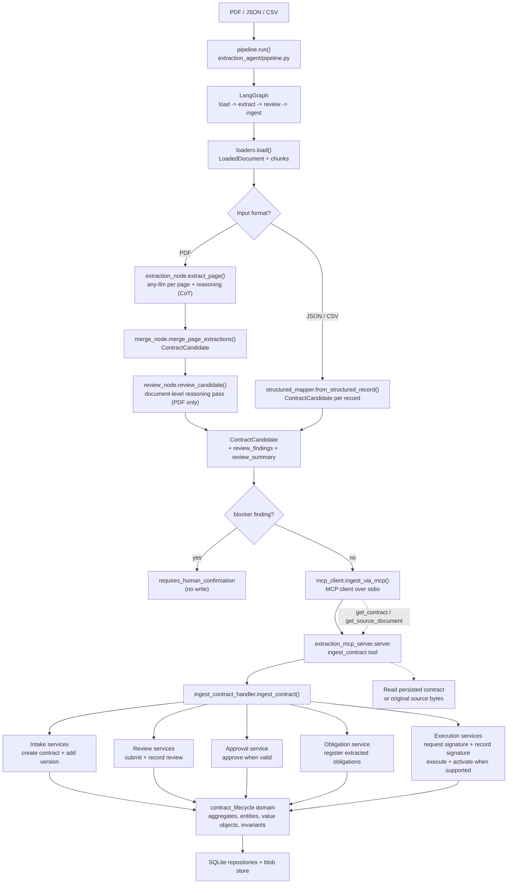

# Architecture

The extraction agent turns a contract source file into a validated contract candidate and submits it to the Contract Lifecycle Management (CLM) domain through the MCP server.

The extraction agent only communicates with the CLM domain through `mcp_client.py`. The MCP server is the boundary that converts the candidate into application commands, so domain invariants remain enforced for imported data.

## Agent Orchestration

The extraction agent is invoked by the web agent orchestrator when the user chooses extraction (or when the Auto planner schedules an `extract` step) and supplies a PDF, JSON, or CSV attachment. An optional natural-language instruction, such as "extract this as a vendor agreement", becomes a non-authoritative directive: it can guide procedural RAG and prompt context but never overrides visible source evidence. A directive that disagrees with the reviewed classification is a `blocker` finding, returning `requires_human_confirmation` rather than silently changing the candidate.

The orchestrator emits safe progress events (`routing`, `extracting`, `reviewing`) over SSE. It can include page number and attempt count, but never private model reasoning, raw prompt content, source bytes, or credentials. The extraction trace is the durable technical record and is shown only in the admin-only Agent Administration portal, alongside working-memory keys and retrieval metadata.

## Document Review

`review_node.review_candidate()` is the single document-level reasoning pass (see [Memory and Reasoning](../../../docs/memory-and-reasoning.md)). Deterministic consistency checks always run; an LLM call additionally does the final `contract_type` classification, a self-consistency vote of an independent full-text read against the page-merge result, and free-form `ReviewFinding`s. It classifies only when the page pass produced nothing, never overwrites a specific classification, and gates the write on any `blocker` finding. The review call is best-effort - on failure the deterministic findings still apply and the trace records `document_review: unavailable`.

The same call also returns `obligation_analysis` - each material obligation/right read as `{trigger, consequence, deadline basis, materiality}` - which is folded into `review_summary` and recorded as the `obligation_analysis` trace stage. Deterministic checks flag silent auto-renewal, an unbounded termination-for-convenience right, an obligation with timing but no trigger, and a high-materiality obligation with no stated consequence (all `info`/`warning`, never blockers). Obligation triggers/consequences and the renewal/termination terms captured per page are persisted onto the contract in `ingest_contract_handler` via `Contract.record_extracted_terms` (a `RecordContractTermsCommand` handled by `ContractIntakeService`, filling only fields still at their default).

## Hybrid RAG and Reruns

When `EXTRACTION_RAG_ENABLED=1`, the PDF path retrieves procedural knowledge
from the local hybrid store before page extraction. SQLite FTS5 provides exact
matches for legal terms, headings, and entities; the embedding index provides
semantic matches for contract-type guidance and similar examples. RAG informs
what to look for and how to validate it, while the source PDF remains the
authority.

On reruns, keep the previous candidate and trace, retrieve the relevant
profile/examples again, target unresolved or conflicting fields, and record a
new attempt. Do not silently overwrite a confirmed value; route conflicts to
human confirmation.

## Runtime Flow

1. `pipeline.run(file_path, database_path)` invokes the compiled graph.
2. `loaders.load()` reads the file, computes its SHA-256 hash, and creates page or record chunks.
3. The graph extracts PDF pages with the LLM (with per-page CoT and working memory), or maps JSON/CSV records directly.
4. PDF page results are merged and deduplicated. Conflicting singleton values are retained in `field_conflicts`.
5. `review_node` runs the document-level reasoning pass over the PDF candidate (skipped for structured input).
6. `ingest_node` blocks on any `blocker` finding (`requires_human_confirmation`); otherwise `mcp_client.py` starts `python -m extraction_mcp_server.server` over stdio and calls `ingest_contract`.
7. The MCP handler stores the source bytes, then advances the contract through the available application services.
8. Missing legal facts stop only the unsupported lifecycle stage. The response records the reason in `skipped_stages` instead of inventing facts.
9. Re-ingesting the same source is idempotent because `source_document_hash` determines the contract number.
