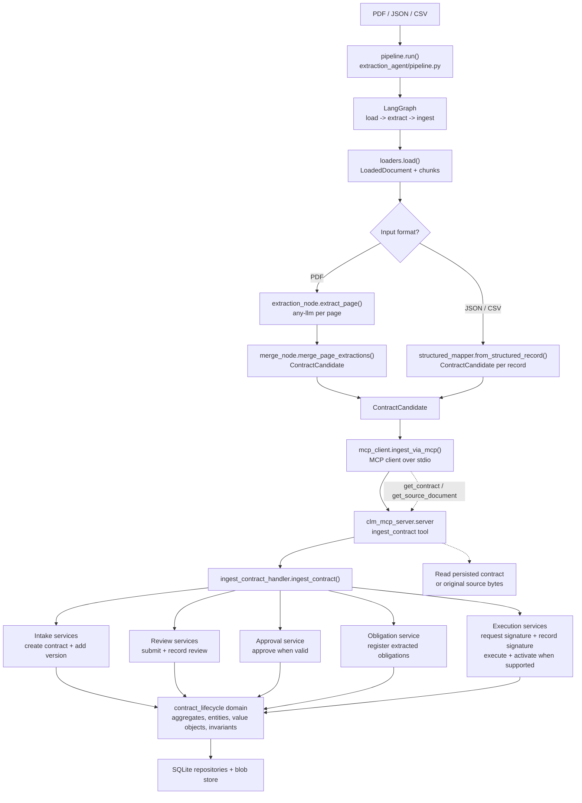

# Architecture

The extraction agent turns a contract source file into a validated contract candidate and submits it to the Contract Lifecycle Management (CLM) domain through the MCP server.

The extraction agent only communicates with the CLM domain through `mcp_client.py`. The MCP server is the boundary that converts the candidate into application commands, so domain invariants remain enforced for imported data.

## Runtime Flow

1. `pipeline.run(file_path, database_path)` invokes the compiled graph.
2. `loaders.load()` reads the file, computes its SHA-256 hash, and creates page or record chunks.
3. The graph extracts PDF pages with the LLM, or maps JSON/CSV records directly.
4. PDF page results are merged and deduplicated. Conflicting singleton values are retained in `field_conflicts`.
5. `mcp_client.py` starts `python -m clm_mcp_server.server` over stdio and calls `ingest_contract`.
6. The MCP handler stores the source bytes, then advances the contract through the available application services.
7. Missing legal facts stop only the unsupported lifecycle stage. The response records the reason in `skipped_stages` instead of inventing facts.
8. Re-ingesting the same source is idempotent because `source_document_hash` determines the contract number.
