# Query Agent Architecture

The query agent answers contract questions with cited evidence from contracts
that have already passed tenant authorization. It has no direct database access
and does not use source filenames as a retrieval signal.

```mermaid
flowchart LR
    Client["React chat / CLI"] --> API["Authenticated orchestrator API"]
    API --> Stream["SQLite run + event log\nSSE replay"]
    API --> History["conversation_window + rolling summary\n(role + text only)"]
    API --> MCP["query_mcp_server\nanalyze_contracts / count / list / find / aggregate_contracts / search_clauses"]
    MCP --> Scope["contract_tenants\ntenant filter"]
    Scope --> Plan["_plan() - name a prompt template (templates.yaml)\n-> tool calls within its allowlist\n_guard_plan: filter-value hygiene only"]
    Plan --> Gather["_gather()\ncount / list / find / aggregate_contracts (portfolio.py, exact; dates + money math)\nsearch_clauses (flatten + embedding rank)"]
    Gather --> Interpret["_interpret() - clause branch only\ntrigger -> consequence -> what matters"]
    Interpret --> Coverage["_coverage()\nmatched vs read; spans_portfolio?"]
    Coverage --> Draft["compose\nstructural: _compose_deterministic() (no LLM)\nclause synthesis: _draft_answer() (LLM)"]
    Draft --> Verify["_verify()\ncounts authoritative; clause claims vs cited evidence;\nno false completeness while coverage is partial"]
    Verify --> Result["Answer + citations +\nconfidence + uncertainty"]
    Result --> Stream
```

## Steps

1. The client submits an analysis message (or the Auto planner schedules an `analyze` step) with an optional contract ID.
2. The API validates the bearer token and derives the organization context; the client never supplies trusted tenant identity.
3. The orchestrator assembles the conversation `history` (rolling summary + recent turns, text only), records the run, and emits a safe `retrieving_evidence` event.
4. The query MCP verifies the organization owns every selected contract and maps authorized snapshots. `count_contracts`, `list_contracts`, and `search_clauses` return deterministically with no LLM; `analyze_contracts` calls `answer()`.
5. `answer()` **plans** (one LLM call names a prompt template — [`templates.yaml`](../prompts/templates.yaml), catalogue [`docs/query-agent-prompt-templates.md`](../../../docs/query-agent-prompt-templates.md) — and emits one tool call per need using only that template's tools; `QUERY_PLAN_TOOLS=0` is a degraded mode that routes by deterministic keyword + facet matching to the deterministic templates only, and is also tried as a **backstop** whenever the LLM planner is unavailable or names nothing usable. `_guard_plan` does filter-value hygiene only: it normalises facet spelling, forces a relative-date / value / facet filter parsed from the text onto an unscoped call, and drops any call outside the template allowlist — no tool selection, no fabricated plan. A question that projects onto **no** template on either path returns `needs_clarification=true` — a targeted question grounded in the portfolio's real facets — bounded by `QUERY_CLARIFY_MAX_ROUNDS` on both the orchestrator, which owns the round count, and the agent itself as a second gate), **gathers** by running every call (`portfolio.py` for exact counts / lists / clause enumeration / value math, embedding-ranked `search_clauses` for snippets), **interprets** clause snippets when present, records **coverage** (matched set vs what the model read), **composes** the answer (deterministic template from tool output for structural questions; an LLM draft only when clause snippets were gathered), and **verifies** it (deterministic blocks authoritative; `matched` is the answer when a filter is set; clause claims checked against citations; an answer implying it covered every contract while coverage is partial is rejected). See [ADR-0004](../../../docs/adr/0004-query-agent-routing-and-retrieval.md).
6. The orchestrator persists and streams the answer or terminal failure. It never streams hidden reasoning, tokens, raw source files, or provider secrets.

## Knowledge and Memory

- **Authoritative data**: the Query MCP maps organization-owned CLM contracts (metadata, parties, clauses, obligations, dates, commercial/renewal/termination terms). `count_contracts` / `list_contracts` answer portfolio questions exactly from this; retrieval never counts.
- **Working memory**: the scratchpad (planned tool calls, evidence labels, the interpretation's `what_matters`) for one request. Discarded when the response completes.
- **Episodic memory**: owned by the orchestrator - the conversation/run/event log plus the bounded window and rolling summary passed in as `history`. The agent itself is stateless.
- **Semantic retrieval**: in-request embedding ranking over authorized evidence (`query_agent/retrieval.py`), with a keyword fallback, invoked by the `search_clauses` branch of the plan. A persistent tenant-partitioned clause index is future work.

`organization_id` is trusted context passed from the authenticated web boundary to the local stdio MCP server. A network-exposed MCP deployment must derive it from MCP-layer authentication instead.
