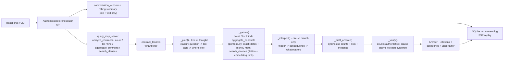

# Query Agent Architecture

The query agent answers contract questions with cited evidence from contracts
that have already passed tenant authorization. It has no direct database access
and does not use source filenames as a retrieval signal.

## Steps

1. The client submits an analysis message (or the Auto planner schedules an `analyze` step) with an optional contract ID.
2. The API validates the bearer token and derives the organization context; the client never supplies trusted tenant identity.
3. The orchestrator assembles the conversation `history` (rolling summary + recent turns, text only), records the run, and emits a safe `retrieving_evidence` event.
4. The query MCP verifies the organization owns every selected contract and maps authorized snapshots. `count_contracts`, `list_contracts`, and `search_clauses` return deterministically with no LLM; `analyze_contracts` calls `answer()`.
5. `answer()` **plans** (one LLM call classifies the question - count / list / enumerate-by-clause / math / clause-detail / mixed - and emits one tool call per need, each with an optional `where` filter; keyword guards add the tool and the relative-date / value filters the planner missed), **gathers** by running every call (`portfolio.py` for exact counts / lists / clause enumeration / value math, embedding-ranked `search_clauses` for snippets), **interprets** the clause snippets when present, **drafts** an answer synthesising across counts / lists / aggregates / evidence, and **verifies** it (the deterministic blocks are authoritative, clause claims checked against citations).
6. The orchestrator persists and streams the answer or terminal failure. It never streams hidden reasoning, tokens, raw source files, or provider secrets.

## Knowledge and Memory

- **Authoritative data**: the Query MCP maps organization-owned CLM contracts (metadata, parties, clauses, obligations, dates, commercial/renewal/termination terms). `count_contracts` / `list_contracts` answer portfolio questions exactly from this; retrieval never counts.
- **Working memory**: the scratchpad (planned tool calls, evidence labels, the interpretation's `what_matters`) for one request. Discarded when the response completes.
- **Episodic memory**: owned by the orchestrator - the conversation/run/event log plus the bounded window and rolling summary passed in as `history`. The agent itself is stateless.
- **Semantic retrieval**: in-request embedding ranking over authorized evidence (`query_agent/retrieval.py`), with a keyword fallback, invoked by the `search_clauses` branch of the plan. A persistent tenant-partitioned clause index is future work.

`organization_id` is trusted context passed from the authenticated web boundary to the local stdio MCP server. A network-exposed MCP deployment must derive it from MCP-layer authentication instead.
