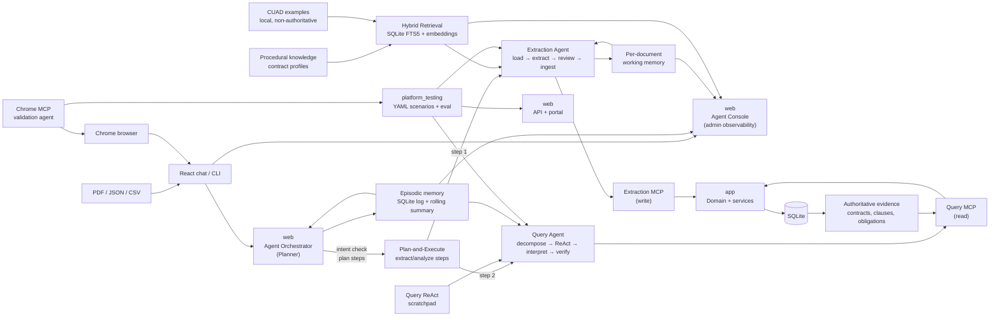

# Agentic Solution Architecture

How the platform orchestrates three autonomous agents that reason and act within strict guardrails to extract, analyze, and query contracts.

## System Overview



## Three Agent Types

### Orchestrator Agent (Plan-and-Execute)

**Role**: Route user intent and coordinate extraction and analysis steps.

- **Intent Check**: Decode whether the user wants to extract, analyze, or both
- **Step Threading**: Pass prior step results to the next step (no cascading failures)
- **Result Synthesis**: Combine extraction output + analysis into coherent response for the user

**Process**:
1. Receive message from web portal or CLI
2. Check user intent (extract, query, or combined)
3. Plan the sequence of steps
4. Execute each step and thread results forward
5. Synthesize final response to user

**Guardrails**:
- Timeboxed per step (5 min default)
- Persists conversation to SQLite (`episodic memory`)
- Cannot call extraction/query agents directly; uses message passing via LangGraph

---

### Extraction Agent (LangGraph State Machine)

**Role**: Transform source documents into validated contract candidates.

**Pipeline**: Load → Extract → Review → Ingest

1. **Load** PDF/JSON/CSV from ingestion endpoint
2. **Per-Page Extraction** (PDF only):
   - LLM extracts fields: title, parties, effective date, key clauses, obligations
   - Working memory threaded across pages (title, type, parties, defined_terms, last_heading, renewal_terms, termination_terms)
   - Chain-of-thought reasoning logged, then dropped
   - Retry if page returns empty or missing required fields
3. **Merge** extracted pages into single document candidate
4. **Document Review** (if enabled):
   - Final classification of contract type
   - Cross-check parties/dates against full text (voting)
   - Consistency checks (dates make sense, obligations have deadlines, etc.)
   - Raises `ReviewFinding` blockers (requires human approval)
5. **Obligation Analysis**:
   - Reads each material commitment as `{trigger, consequence, deadline, materiality}`
   - Flags silent auto-renewal, unbounded termination-for-convenience, high-materiality obligations with no deadline
   - All informational, never blockers
6. **Ingest** via MCP (if no blockers):
   - Writes contract + clauses + obligations to Domain Store
   - Records evidence references (PDFs, extracted text)
   - Persists renewal/termination terms for query agent

**Hybrid RAG Retrieval**:
- Consults SQLite FTS5 (lexical) + vector embeddings (semantic)
- Retrieves CUAD examples and procedural knowledge
- Feeds guidance to extraction step (fields to look for, contract type patterns)
- Source PDF remains the authority; retrieval never overrides visible evidence

**Working Memory** (per document, discarded after run):
- `title`, `contract_type`, `parties`, `defined_terms`, `last_heading`, `renewal_terms`, `termination_terms`
- Continuity tail across pages of one document
- Never shared across documents or tenants

---

### Query Agent (Plan → Gather → Interpret → Verify)

**Role**: Answer questions about authorized contract evidence.

**Process**:
1. **Decompose**: Break user question into sub-queries
2. **Gather**: 
   - Call deterministic portfolio tools: `count_contracts`, `list_contracts`, `search_clauses`
   - Retrieve clause text and metadata from MCP read API
   - Never sample; always enumerate complete results
3. **Interpret**: 
   - Use LLM only to map retrieved evidence to user intent
   - Never hallucinate counts or lists
   - Trigger → consequence chains from review passes
4. **Verify**: 
   - Double-check facts against database
   - Supply full source references (contract ID, clause type, text location)

**Guardrails**:
- Deterministic baseline tools prevent hallucination
- LLM reasoning only on interpretation (safe zone)
- Complete enumeration (never sampling)
- Per-call schema validation

**Memory**:
- **Query Scratchpad**: ReAct reasoning for one request (discarded after response)
- **Episodic Memory**: User/assistant messages from conversation history (SQLite log + rolling summary passed to next query)

---

## Memory Model

| Type | Scope | Persistence | Purpose |
|------|-------|-------------|---------|
| **Working Memory** (Extraction) | Per document | None (discarded after run) | Thread state across pages: title, parties, terms, obligations. Never cross-document or cross-tenant. |
| **ReAct Scratchpad** (Query) | Per request | None (discarded after response) | Step-by-step reasoning for decompose → gather → interpret → verify. |
| **Episodic Memory** | Per conversation | SQLite log + rolling summary | User messages, assistant responses, run status, SSE events. Bounded window for follow-ups. |
| **Semantic Knowledge** | Global | SQLite + embeddings (authoritative contracts + CUAD) | Contract evidence + CUAD examples + procedural knowledge. Read-only for agents. |

---

## Guardrails and Isolation

### Per-Call Timeouts
- Default 5 minutes per LLM call
- Extraction agent retries timed-out steps once
- Query agent gracefully falls back to prior results

### Schema-Constrained Output
- Every MCP tool response is a Pydantic model
- LLM output is parsed and validated before use
- Invalid schemas are logged and caught

### Tenant Isolation at Query Time
- Every MCP tool checks `contract_tenants` FK
- Query agent reads only authorized contracts
- Cross-tenant data impossible by design

### Blocker Findings
- Extraction review raises `blocker` findings
- Blockers require human approval before ingest
- Logged to admin console for review

---

## Orchestration Patterns

### Extraction Workflow

```
Portal (File Upload + Tenant ID)
    ↓
Web Ingestion Endpoint
    ↓
Orchestrator (Route to Extraction Agent)
    ↓
Extraction Agent (Load → Extract → Review → Ingest)
    ↓
MCP Extraction Server (Validate tenant, enforce schema)
    ↓
Domain Services (Cascade to contracts, clauses, obligations)
    ↓
SQLite (Domain Store)
    ↓
Portal (Show ingested contract + any review blockers)
```

### Query Workflow

```
Portal (User Question + Tenant ID)
    ↓
Orchestrator (Route to Query Agent)
    ↓
Query Agent (Decompose → Gather → Interpret → Verify)
    ↓
MCP Query Server (Read-only, enforce tenant scope)
    ↓
Domain Services (Tenant-scoped reads)
    ↓
SQLite (Read authorized contracts)
    ↓
Query Agent (Synthesize response with evidence)
    ↓
Portal (Show results + source references)
```

---

## Testing Strategy

- **Extraction Agent**: Tested with mock MCP, mock LLMs, real PDFs/JSON/CSV files
- **Query Agent**: Tested with mock MCP, deterministic question/answer pairs
- **Orchestrator**: Tested with mock agents, real message passing, SQLite episodic log
- **Integration**: Full system with running services, real MCP boundaries, tenant isolation verification

---

## References

- [Isolation Strategy](isolation-strategy.md) - How agents communicate through MCP
- [Design Principles](design-principles.md) - Why architecture is designed this way
- [Memory and Reasoning](memory-and-reasoning.md) - Detailed memory model and reasoning patterns
- [Extraction Agent Documentation](../agents/extraction_agent/README.md) - Implementation details
- [Query Agent Documentation](../agents/query_agent/README.md) - Implementation details
