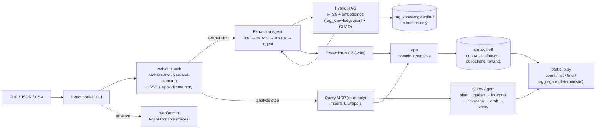

# Agentic Solution Architecture

How the platform orchestrates three autonomous agents that reason and act within strict guardrails to extract, analyze, and query contracts.

## System Overview

Two databases, two readers: `clm.sqlite3` is the authoritative domain store —
the query agent reads it, the extraction MCP writes it. `rag_knowledge.sqlite3`
holds contract-type profiles + CUAD clause embeddings and is read **only** by the
extraction agent.

**Dependency direction:** `query_mcp_server` and `clm_mcp_server` *import*
`query_agent.answer` / the extraction handlers — the MCP server wraps the agent,
not the other way round. Agents never import `app/` internals.

## Three Agent Types

### Orchestrator Agent (Plan-and-Execute)

**Role**: Route user intent and coordinate extraction and analysis steps.

- **Intent Check**: Decode whether the user wants to extract, analyze, or both
- **Step Threading**: Pass prior step results to the next step (no cascading failures)
- **Result Synthesis**: Combine extraction output + analysis into coherent response for the user

**Process**:
1. Receive message from web portal or CLI
2. Check user intent (extract, query, or combined)
3. Plan the sequence of steps
4. Execute each step and thread results forward
5. Synthesize final response to user

**Guardrails**:
- Timeboxed per step (5 min default)
- Persists conversation to SQLite (`episodic memory`)
- Cannot call extraction/query agents directly; uses message passing via LangGraph

---

### Extraction Agent (LangGraph State Machine)

**Role**: Transform source documents into validated contract candidates.

**Pipeline**: Load → Extract → Review → Ingest

1. **Load** PDF/JSON/CSV from ingestion endpoint
2. **Per-Page Extraction** (PDF only):
   - LLM extracts fields: title, parties, effective date, key clauses, obligations
   - Working memory threaded across pages (title, type, parties, defined_terms, last_heading, renewal_terms, termination_terms)
   - Chain-of-thought reasoning logged, then dropped
   - Retry if page returns empty or missing required fields
3. **Merge** extracted pages into single document candidate
4. **Document Review** (if enabled):
   - Final classification of contract type
   - Cross-check parties/dates against full text (voting)
   - Consistency checks (dates make sense, obligations have deadlines, etc.)
   - Raises `ReviewFinding` blockers (requires human approval)
5. **Obligation Analysis**:
   - Reads each material commitment as `{trigger, consequence, deadline, materiality}`
   - Flags silent auto-renewal, unbounded termination-for-convenience, high-materiality obligations with no deadline
   - All informational, never blockers
6. **Ingest** via MCP (if no blockers):
   - Writes contract + clauses + obligations to Domain Store
   - Records evidence references (PDFs, extracted text)
   - Persists renewal/termination terms for query agent

**Hybrid RAG Retrieval**:
- Consults SQLite FTS5 (lexical) + vector embeddings (semantic)
- Retrieves CUAD examples and procedural knowledge
- Feeds guidance to extraction step (fields to look for, contract type patterns)
- Source PDF remains the authority; retrieval never overrides visible evidence

**Working Memory** (per document, discarded after run):
- `title`, `contract_type`, `parties`, `defined_terms`, `last_heading`, `renewal_terms`, `termination_terms`
- Continuity tail across pages of one document
- Never shared across documents or tenants

---

### Query Agent (plan → gather → interpret → coverage → draft → verify)

**Role**: Answer organization-wide questions about tenant-scoped stored contracts.

| Stage | What it does | LLM? |
|---|---|---|
| **plan** | Classify the question, emit one tool call per need with a `where` filter. `QUERY_PLAN_TOOLS=0` (default for small models) uses deterministic keyword + facet routing instead. | opt-in |
| **gather** | Run the calls. `count_contracts` / `list_contracts` / `find_contracts` / `aggregate_contracts` are exact deterministic scans over `portfolio.py`; `search_clauses` is embedding-ranked, for clause detail only. Complete enumeration, never sampling. | no |
| **interpret** | Only when clause snippets were gathered — build trigger → consequence → `what_matters`. `QUERY_INTERPRET`. | yes (best-effort) |
| **draft** | Compose the answer + citations. For structural questions (count / list / breakdown / enumerate / aggregate — no clause snippets) `_compose_deterministic` templates it with **zero LLM calls** (`QUERY_DETERMINISTIC_COMPOSE`, default on). The LLM draft runs only for clause synthesis. | conditional |
| **verify** | `counts` / `contract_lists` are authoritative for numbers; clause claims need cited evidence. Drops unsupported citations, calibrates confidence. `QUERY_VERIFY`. | yes |

The contract data is authoritative — the model cannot retrieve outside what the
Query MCP returns, and a provider failure ends the run rather than guessing.
Money and date arithmetic is always done in `contract_calc`, never by the model.

**Memory**: stateless. A per-request scratchpad (planned calls, evidence labels,
`what_matters`), discarded after the response; the orchestrator passes a
read-only `history` (role + text).

See [Memory and Reasoning](memory-and-reasoning.md) for the full per-stage
detail and every knob.

---

## Memory Model

| Type | Scope | Persistence | Purpose |
|------|-------|-------------|---------|
| **Working Memory** (Extraction) | Per document | None (discarded after run) | Thread state across pages: title, type, parties, defined terms, renewal/termination terms. Never cross-document or cross-tenant. |
| **Scratchpad** (Query) | Per request | None (discarded after response) | Planned tool calls, evidence labels, `what_matters` for one `plan → gather → interpret → coverage → draft → verify` run. |
| **Episodic Memory** | Per conversation | SQLite log + bounded window + rolling summary | User/assistant messages, run status, SSE events. Owned by the orchestrator; the query agent gets it as read-only `history`. |
| **Semantic Knowledge** (Extraction only) | Global | `rag_knowledge.sqlite3` (FTS5 + embeddings) | Contract-type profiles + CUAD clause examples. Read-only. The query agent does **not** use this — it ranks the tenant's own clauses in-request. |

See [Memory and Reasoning](memory-and-reasoning.md) for the authoritative table.

---

## Guardrails and Isolation

### Per-Call Timeouts
- Default 5 minutes per LLM call
- Extraction agent retries timed-out steps once
- Query agent gracefully falls back to prior results

### Schema-Constrained Output
- Every MCP tool response is a Pydantic model
- LLM output is parsed and validated before use
- Invalid schemas are logged and caught

### Tenant Isolation at Query Time
- Every MCP tool checks `contract_tenants` FK
- Query agent reads only authorized contracts
- Cross-tenant data impossible by design

### Blocker Findings
- Extraction review raises `blocker` findings
- Blockers require human approval before ingest
- Logged to admin console for review

---

## Orchestration Patterns

**Extract:** portal upload → orchestrator `extract` step → Extraction Agent
(`load → extract → review → ingest`) → Extraction MCP (tenant + schema) → domain
services → `clm.sqlite3`. Review `blocker` findings return
`requires_human_confirmation` and stop the write.

**Analyze:** portal question → orchestrator `analyze` step → Query MCP (tenant
check, then `answer()`) → `plan → gather → interpret → coverage → draft → verify` →
streamed answer + citations, or a terminal failure (never a guess).

**Second ingest path (no LLM):** `synthetic_data_loader/seed_contracts.py` builds
`ContractCandidate`s deterministically and calls the `ingest_contract` handler
directly — the default validation portfolio. See [Data Lifecycle](data-lifecycle.md).

---

## Testing Strategy

- **Extraction Agent**: Tested with mock MCP, mock LLMs, real PDFs/JSON/CSV files
- **Query Agent**: Tested with mock MCP, deterministic question/answer pairs
- **Orchestrator**: Tested with mock agents, real message passing, SQLite episodic log
- **Integration**: Full system with running services, real MCP boundaries, tenant isolation verification

---

## References

- [Isolation Strategy](isolation-strategy.md) - How agents communicate through MCP
- [Design Principles](design-principles.md) - Why architecture is designed this way
- [Memory and Reasoning](memory-and-reasoning.md) - Detailed memory model and reasoning patterns
- [Extraction Agent Documentation](../agents/extraction_agent/README.md) - Implementation details
- [Query Agent Documentation](../agents/query_agent/README.md) - Implementation details
