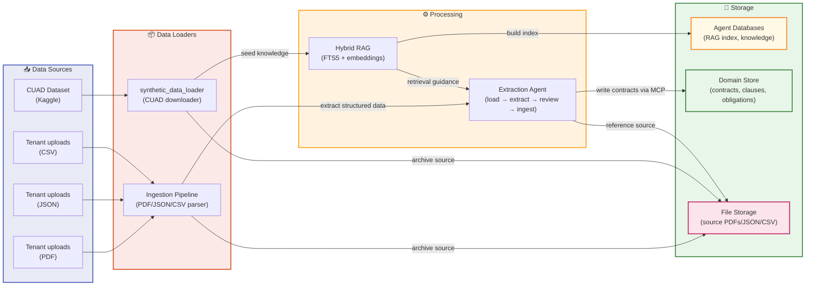

# Data Lifecycle

How contract data flows through the system from source to storage and retrieval.

## Overview

The platform accepts contract data from **two sources**:

1. **Tenant Uploads** - Organizations upload their contracts (PDF, JSON, CSV)
2. **CUAD Dataset** - Kaggle's Atticus Open Contract Dataset for seed knowledge

All data is processed through specialized loaders, extracted by agents, and stored in separate, isolated databases.

## Data Flow Diagram

## Data Sources

### Tenant Uploads

Organizations upload contracts in three formats:

- **PDF** - Scanned or digital contracts (most common)
- **JSON** - Structured contract data with metadata
- **CSV** - Tabular contract information for bulk ingestion

All uploads are tenant-scoped via organization ID to maintain isolation.

### CUAD Dataset

The Kaggle **Atticus Open Contract Dataset** provides:
- Non-authoritative examples for contract type guidance
- Procedural knowledge (contract profiles, field recommendations)
- Used to train and seed the RAG knowledge base

Downloaded on-demand via `synthetic_data_loader` during seeding.

## Data Loaders

### Ingestion Pipeline

Processes tenant uploads:
1. **Parse** PDF/JSON/CSV → extract text and structure
2. **Normalize** → contract metadata (title, parties, dates, type)
3. **Pass to Extraction Agent** → per-page extraction with working memory
4. **Archive source** → Blob Store for audit trail

### synthetic_data_loader

Handles CUAD dataset:
1. **Download** CUAD from Kaggle via `kagglehub`
2. **Extract** CUAD contracts (PDF → text)
3. **Index** in knowledge store (FTS5 + embeddings)
4. **Archive** PDFs in Blob Store

## Processing

### Extraction Agent

For each tenant upload:
1. **Load** PDF/JSON/CSV from ingestion
2. **Extract** contract fields:
   - Title, parties, contract type
   - Effective/expiration dates
   - Key clauses and obligations
3. **Review** document-level consistency
4. **Ingest** via MCP → Domain Store (if no blockers)

Uses **Hybrid RAG** for guidance (CUAD examples + procedural knowledge).

### Hybrid RAG

Retrieves guidance for extraction:
- **FTS5** exact-match search over legal terms
- **Vector embeddings** semantic similarity for contract types
- Consults CUAD examples and procedural knowledge
- Feeds retrieval results to Extraction Agent

## Storage

### Agent Databases

**Owned by Agentic System** — non-authoritative:
- **RAG Index** (FTS5 + embeddings)
  - Full-text search over contract clauses
  - Vector embeddings for semantic retrieval
- **Knowledge Store**
  - CUAD examples
  - Procedural knowledge (contract profiles)

Agents **read** from these for guidance only.

### Domain Store

**Owned by App Stack** — authoritative source of truth:
- **Contracts** metadata, source references, tenant ownership
- **Clauses** extracted obligations, triggers, consequences
- **Obligations** with renewal/termination terms
- **Users & Tenants** identity and access control

Agents **write** to this via MCP (which enforces domain rules).

### File Storage

**Audit trail** — immutable source documents:
- **PDFs** uploaded by tenants or from CUAD
- **JSON** structured uploads
- **CSV** tabular uploads
- Source references enable re-extraction if needed

## Tenant Isolation

Every upload is scoped to a tenant (organization):
- **Ingestion** respects organization FK
- **Extraction** tags contracts with organization ID
- **Domain Store** enforces organization-scoped queries
- **MCP tools** check `contract_tenants` FK before any operation

Cross-tenant data is impossible by design.

## Data Lifecycle Example

**Tenant uploads a vendor agreement (PDF):**

1. PDF lands in **Ingestion Pipeline**
2. Text extracted, normalized → contract metadata
3. **Extraction Agent** reads PDF + consults **RAG**:
   - Retrieves CUAD "Service Agreement" examples
   - Gets procedural guidance (parties, payment terms, renewals)
4. Agent extracts: title, parties, dates, key clauses
5. **Review** pass checks for consistency
6. **Ingest** via MCP → **Domain Store** (contract + clauses)
7. **PDF archived** in File Storage
8. Query Agent can now search this contract via authorized MCP reads

## References

- [Component Architecture](../README.md#component-architecture) - System structure and isolation
- [Agentic Solution Architecture](../README.md#agentic-solution-architecture) - How agents orchestrate
- [Seeding Guide](../SEEDING.md) - How to seed the system with data
