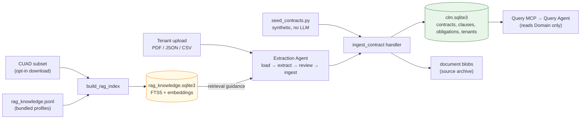

# Data Lifecycle

How contract data flows through the system from source to storage and retrieval.

## Overview

Contract data enters through **three paths**:

1. **Tenant uploads** — organizations upload contracts (PDF / JSON / CSV) → the
   extraction agent (`load → extract → review → ingest`).
2. **Synthetic validation portfolio** — `synthetic_data_loader/seed_contracts.py`
   builds `ContractCandidate`s from a fixed seed (no LLM, no network) and calls
   the `ingest_contract` handler **directly**, bypassing extraction. This is what
   `setup` seeds by default (40 contracts, `--seed capstone-review-2026`).
3. **CUAD dataset** (opt-in) — real SEC-filed contracts used to *ground the
   extraction agent's RAG* and to run the extraction accuracy eval. Downloaded on
   demand (`--with-cuad` / `download_cuad_subset`), not part of default setup.

Contract records land in `clm.sqlite3` (authoritative domain store). CUAD-derived
knowledge lands in `rag_knowledge.sqlite3` and is read only by the extraction
agent — the query agent never touches it.

## Data Flow Diagram

## Data Sources

### Tenant uploads

PDF / JSON / CSV, tenant-scoped by organization ID. Each runs through the
extraction agent and is archived as a document blob.

### Synthetic validation portfolio

`synthetic_data_loader/seed_contracts.py` — deterministic per `--seed`, no LLM,
no network. Builds `ContractCandidate` objects and calls `ingest_contract`
directly (skips extraction). `setup` seeds 40 by default. Its purpose is to give
the query agent data to answer against; it does not exercise extraction. Known
gap: it does not persist `contract_value` / `effective_date` / `execution_date`.

### CUAD dataset (opt-in)

The Atticus **Contract Understanding Atticus Dataset** (CC BY 4.0, SEC-filed
public-company contracts). Two uses, both opt-in:
- **Grounds extraction** — `download_cuad_subset` → `build_rag_index` embeds the
  bundled `rag_knowledge.jsonl` profiles plus any CUAD PDFs into
  `rag_knowledge.sqlite3`.
- **Extraction accuracy eval** — `platform_testing/extraction_eval.py` scores the
  pipeline against `fixtures/cuad_ground_truth.jsonl`.

The dataset strategy (offline-first defaults, one contract-type catalog, a
real-contract stress corpus, CC-BY licensing) is written up in the ADRs under
`docs/adr/` (proposed).

## Processing

### Extraction Agent

For each tenant upload:
1. **Load** PDF/JSON/CSV from ingestion
2. **Extract** contract fields:
   - Title, parties, contract type
   - Effective/expiration dates
   - Key clauses and obligations
3. **Review** document-level consistency
4. **Ingest** via MCP → Domain Store (if no blockers)

Uses **Hybrid RAG** for guidance (CUAD examples + procedural knowledge).

### Hybrid RAG

Retrieves guidance for extraction:
- **FTS5** exact-match search over legal terms
- **Vector embeddings** semantic similarity for contract types
- Consults CUAD examples and procedural knowledge
- Feeds retrieval results to Extraction Agent

## Storage

### Agent Databases

**Owned by Agentic System** — non-authoritative:
- **RAG Index** (FTS5 + embeddings)
  - Full-text search over contract clauses
  - Vector embeddings for semantic retrieval
- **Knowledge Store**
  - CUAD examples
  - Procedural knowledge (contract profiles)

Agents **read** from these for guidance only.

### Domain Store

**Owned by App Stack** — authoritative source of truth:
- **Contracts** metadata, source references, tenant ownership
- **Clauses** extracted obligations, triggers, consequences
- **Obligations** with renewal/termination terms
- **Users & Tenants** identity and access control

Agents **write** to this via MCP (which enforces domain rules).

### File Storage

**Audit trail** — immutable source documents:
- **PDFs** uploaded by tenants or from CUAD
- **JSON** structured uploads
- **CSV** tabular uploads
- Source references enable re-extraction if needed

## Tenant Isolation

Every upload is scoped to a tenant (organization):
- **Ingestion** respects organization FK
- **Extraction** tags contracts with organization ID
- **Domain Store** enforces organization-scoped queries
- **MCP tools** check `contract_tenants` FK before any operation

Cross-tenant data is impossible by design.

## Data Lifecycle Example

**Tenant uploads a vendor agreement (PDF):**

1. PDF lands in **Ingestion Pipeline**
2. Text extracted, normalized → contract metadata
3. **Extraction Agent** reads PDF + consults **RAG**:
   - Retrieves the closest contract-type profile + CUAD clause examples
   - Gets procedural guidance (parties, payment terms, renewals)
4. Agent extracts: title, parties, dates, key clauses
5. **Review** pass checks for consistency
6. **Ingest** via MCP → **Domain Store** (contract + clauses)
7. **PDF archived** in File Storage
8. Query Agent can now search this contract via authorized MCP reads

## References

- [Component Architecture](../README.md#component-architecture) - System structure and isolation
- [Agentic Solution Architecture](../README.md#agentic-solution-architecture) - How agents orchestrate
- [Seeding Guide](../SEEDING.md) - How to seed the system with data
