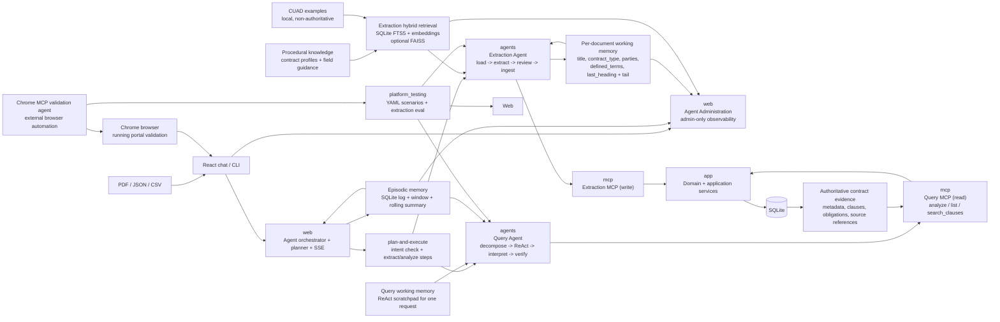

# Legacy System Map

**Historical — captured ~2026-08. Superseded by
[Agentic Solution Architecture](agentic-architecture.md) and
[README Component Architecture](../README.md#-component-architecture).** Kept only
to show how the two views were once combined. Some labels below (e.g. the query
agent as "decompose → ReAct") are from that earlier design and no longer match
the code — the current flow is `plan → gather → interpret → draft → verify`.

## Original Combined System Map

The diagram below shows the original architecture where component and agentic concerns were visualized together. This has been split into:

1. **Component Architecture** (see [README.md](../README.md#component-architecture)) - Layered module structure
2. **Agentic Solution Architecture** (see [README.md](../README.md#agentic-solution-architecture)) - Agent orchestration and reasoning

## Evolution

The original diagram combined:
- **Component structure** (modules, layers, data flow)
- **Agentic orchestration** (agent responsibilities, memory boundaries, reasoning)

As the system matured, these concerns were separated into two distinct views:

### Component View (Architecture-First)
Focus: **What modules exist and how they integrate**
- User interfaces and API layer
- Agent stack, MCP boundary, application stack
- Knowledge retrieval and shared utilities
- Testing and evaluation infrastructure

### Agent View (Agency-First)
Focus: **How autonomous agents reason and act**
- Extraction agent: per-page extraction → merge → review → ingest
- Query agent: decompose → gather → interpret → verify
- Orchestrator: intent check → plan → execute → synthesize
- Memory models: working, episodic, semantic
- Guardrails: timeouts, schema validation, isolation

## Reference

See:
- [README.md - Component Architecture](../README.md#component-architecture)
- [README.md - Agentic Solution Architecture](../README.md#agentic-solution-architecture)
- [Memory and Reasoning](memory-and-reasoning.md)
- [Architecture Evolution](architecture-evolution.md) (if available)
